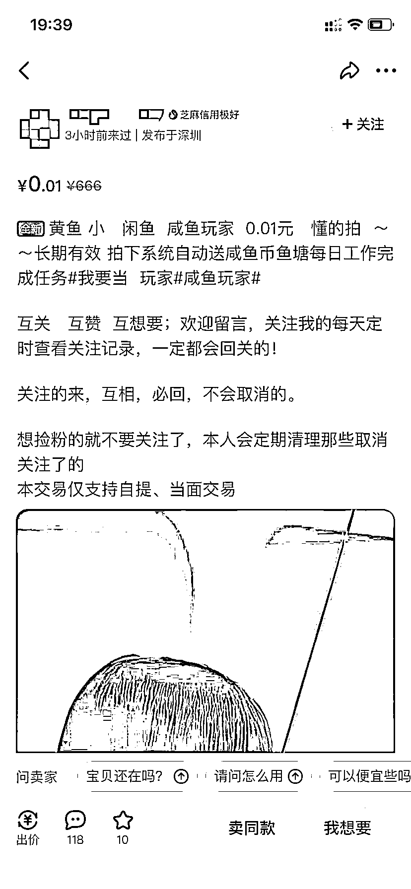
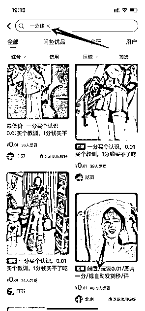
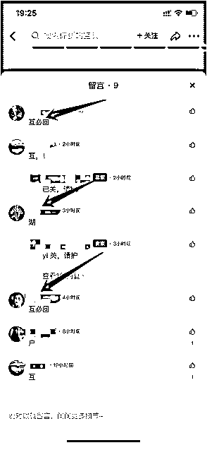
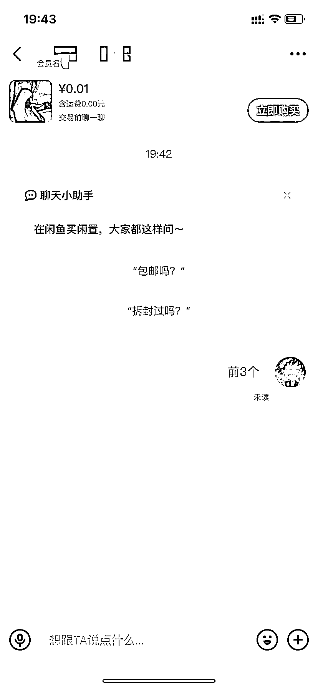
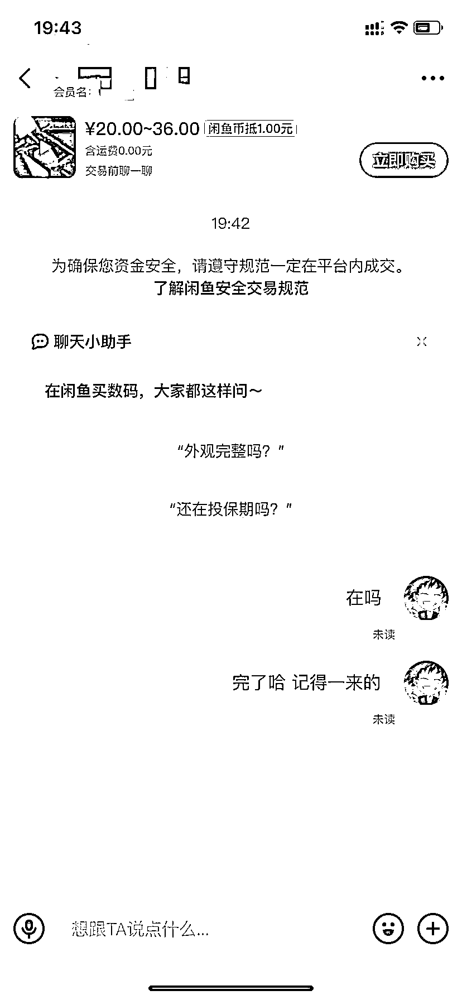

# 6.1.2.2 人工干预优化

搜索，发布关键词为“一分钱”，“教训”的产品，外加下方留言“互”“虎”相关谐音字的商家。目的是借用闲鱼同行，完成人工干预，提升账号的活跃度，优化自家产品。

发布产品，留言的一般都相对来说知道这个方法，比较快点，所以直接找他们相对来说好些。

搜索找到发布“一分钱”“教训”，外加下方留言“互”“虎”的这些商家，下来点击“一分钱”，“教训”产品链接，或者点击留言图像，进入对方主页，点击任意产品进入。

点击产品链接，右下方，“我想要”私聊。

私发：“来 3 个” [一般，单个这种操作 3-5 个链接即可]

完了点击进入相对应商家的主页，下来点击他的另外产品链接进入。

私发：“还有吗？/在吗？/想要” 类似真实客户的咨询即可。

依次，点击主页，点击私聊即可，到操作最后一个产品的时候。

私发：“完了，记得及时来”（或者其他表达）

单天，找 3-8 个这种的商家完成人工干预即可，会有一些不回复之类，不过整体来说，量还是满足咱们需要的。

注意事项

1.可以优先找“想要数” 少的产品链接进入，外加找留言“互”相关谐音的商家。

2.按照上面说道的先找对人，给他人先操作了，很快，其次别人看到操作了，下回过来的几率更高。

3.自己发布“一分钱”“教训”外加留言，及其私发的时候，出现“互”“互相要”这次词，容易违规。

4.单天找这类商家 3-8 个即可，外加单个商家操作产品 3-5 个来的。

5.不用购买他们一分钱，就可以操作上面，如果必须要求操作的跳过。或者单天购买个别几个也问题不大。