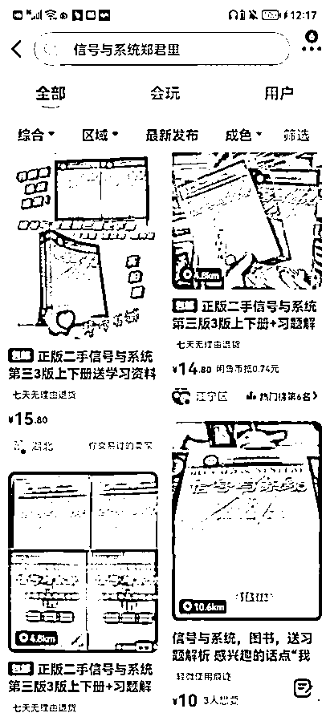

# 7.3 不要过度迷恋各种技术手段

遇到过很多做闲鱼二手书的人，都是一本本手动上书的，我们工作室也是全部找大学生，精选图片上书的，而同时期开始，那些一开始就各种技术手段的人，都没有拿到太大的结果。

有人会问为什么呢？举个例子，当用户来到闲鱼以后，第一步是搜索自己想要的一本书，会出现下图的界面。

先思考下，如果是你，看到这样的界面，你会选择点击进入哪个链接呢？

大概率大家会直接淘汰 1 和 3，在 2、4 里面选择一个点击进去，因为 1 和 3 一个想要都没有，价格还高，图片也没有亮点，选择 2 的理由，就是实拍图真实，而且还是热门榜，一般人都会有从众心理；选择 4 的理由，就是价格便宜，至少还有几个想要，图片看着也不错。

而系统采集上架的图书：

1、质量基本上跟手动的存在较大的差距；

2、批量铺货的人，一天上架几百本，也根本没有心情给一些商品稍微做点数据，比如抽几个商品点点想要；

3、批量铺货的人，更不可能在前期把价格压低，等有了销量和想要的数据后再慢慢涨价。

精细化运营，没有捷径。也不要卖盗版新书，官方会管控，容易封号。

