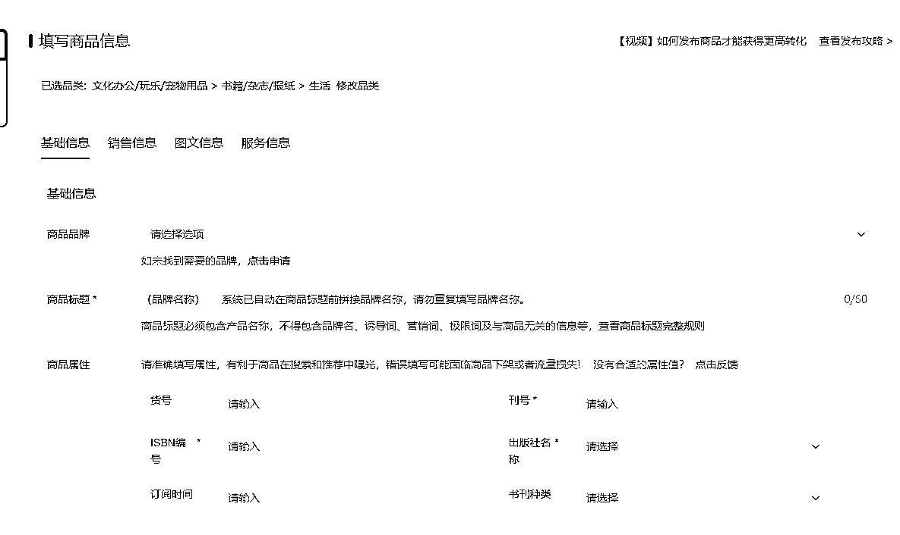

# 6.2 电脑端发布商品

小红书商家助手网页版地址：[`ark.xiaohongshu.com`](https://ark.xiaohongshu.com/)

电脑端可以使用软件来一键搬家，也可以自己手动发布。

1）一键搬家软件

在店铺后台点击服务，进入服务市场选择一款搬家软件。一键搬家的软件在后台都可以试用，可以选择适合自己的进行软件搬家。

一键搬家软件入口：

2）后台手动上架

在小红书商家管理后台手动发布步骤如下：

① 根据自己产品的类目，选择好类目，点击下一步：

② 根据产品的属性，填对应的属性，带*的为必填，其他的选填项：

③ 如果遇到自己的产品品类没有开通（部分类目需要提交对应资质，后台会提示），可以在后台申请：

④填写完所有信息，就可以提交审核啦！

拓展资料：更多和产品上架相关的内容，可前往小红书商家课堂学习：

[`school.xiaohongshu.com/course/list?jumpFrom=school&categoryNo=20210515002`](https://school.xiaohongshu.com/course/list?jumpFrom=school&categoryNo=20210515002)

