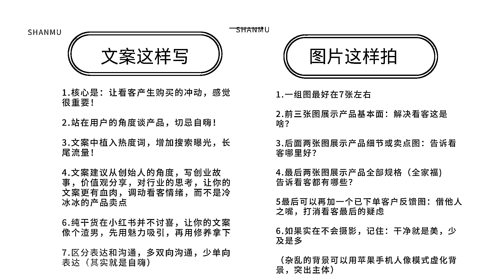
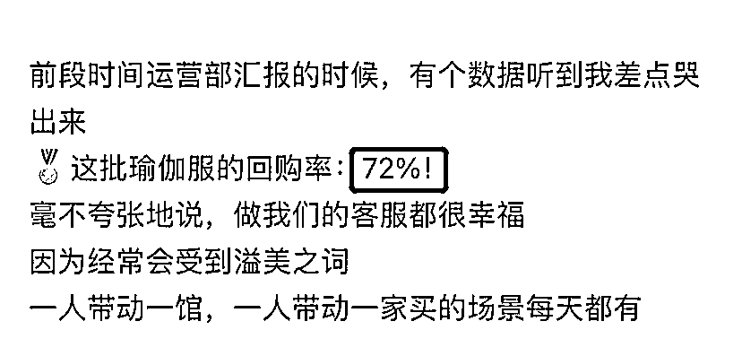
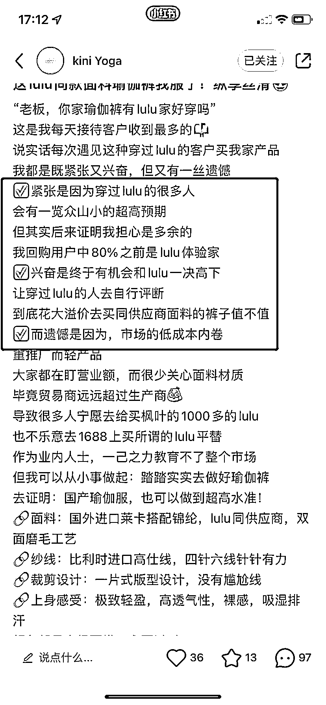

# 7.1.3 批量生产爆款笔记 @杉木

除此之外，也要考虑内容制作成本，矩阵做号的要量化好每篇内容的生产成本，对成本有个清晰的概念，其实我们在找赚钱笔记的时候，也是在对比成本，专业的布景，玩味的文案，讲究的图片构图一定对应高成本，但高成本一定对应高询单么，未必！刚才我举的瑜伽裤就是鲜明案例

（我的内容成本是不到 20 块钱一篇...）

我们不论在小红书还是抖音，都能看到很多低成本高产出的经典案例，内容营销的魅力就在于此。如果你想效率更高一些，其中很多环节其实都可以做 SOP 流程化，压低时间成本，拿拍摄和写内容举例

我一般会在周六日把下一周要发布的素材全部准备好，拍摄如果找模特去拍，最好是在同城找。提前把拍摄注意事项和案例整理好发给模特，免得拍一堆废片浪费时间；另外完全没必要找专业模特去拍，也没必要后期处理照片，这不是拍淘宝主图详情页。小红书无论是平台还是用户，都更喜欢真实分享，效果反而更好。

内容生产也可以流程化，这样可以大大提升内容制作的效率。比如我的内容，图片是有共性的，基本每篇笔记的一组图里，都会有产品整体展示图，细节展示图，客户反馈图。文案上也有大量共性。我一天可以生产这种内容 10 篇以上。

我们前期在确定内容模板的时候可以多试几个，某篇笔记高的话就一直用这个就行。不要觉得是不是发多了就限流了，不会，这点放心好了，只要你内容不完全重复就行。

小红书图文内容可以分为：标题，图片，文案

先说标题：分享一个企业号起标题简单粗暴好用的方式，直接套用数据比较高的带货标题，比如我现在去小红书随便找一个标题

“挖到宝了！！这颜值实用双在线的婴儿车真香”

我们要做的是套用这个模板，填充上我们的产品关键词和卖点关键词

所以我要用这个标题就是：“挖到宝了！！这 lulu（热度词）同面料（需求词）瑜伽服（产品词）真香”

再来说文案和图片：

企业号的文案是比较灵活的，可以直接写产品，也可以从创始人的身份，写自己的创业心得，从故事引出产品，我建议大家可以多试试后者，文案中除产品介绍外，加上自己的价值观分享，对行业的思考，或者与客户的趣事，客户的真实反馈等.

注意：企业号是不可以用第一人称“我”的口吻去写产品使用感受的，否则平台会给笔记限流

下面是我总结的一些图文制作小 tips：

内容这块核心还是对标赚钱笔记写，这也是为啥我在找对标赚钱笔记花了如此多笔墨，因为这真的很重要。这里分享一个我认为最能调动人情绪的，最容易产生询单的：故事体文案

爱听故事是人的天性，尤其是在女性用户比例如此高的小红书平台，故事是调动你文案情绪的催化剂，一个好的故事可以既能引发讨论吸引流量，又能对你新人吸引精准流量导向付费

下面这几个点，是我总结出来的一些高询单内容的秘密，另外整理了几套内容模板供各位参考

一切都要围绕：让用户感觉到你是为他好，替他考虑，牵着用户的情绪走，再强调一遍：

感觉很重要！！

1） 说出用户最深的痛或（喜），比如这个行业市场价格不透明，比如某知名品牌溢价太多，很多人消费不起，我这是厂家直销，同质量的东西。

再比如我从某厂辞职创业，某厂剥削严重，出来独立创业巴拉巴拉。当然也可以说“喜”也就是大家都认可的观点。

写这些是为了引发强烈共鸣，一般放在开头，你要让用户读完后有：的确如此！那就达到目的了，这样你就和看客统一“战线”了，咱们是一伙的，下面我再说啥都是为了你好，形成了基础信任。上次分享种大家做市场调查其实就是为了做这一层铺垫，抓住用户真正的痛点

比如：

2） 顾客证言：客服和顾客的趣事对话。

这个故事最好一波三折，用对话式让情景再现，可以从中穿插客户对于产品的好评反馈。案例：

PS：挑选出顾客证言并不难，关键是证言是否击中用户核心需求

3） 写自己的价值观

可以提出一条脍炙人口且表明你产品价值观的 slogan，聊初心。

并在不同内容中反复提及（注意 slogan 别整的跟大牌一样喊口号，像什么 just do it，来点实际的）

4） 写销量

“利⽤⼈们的从众⼼理，明⽰或暗⽰产品‘畅销’，不但能激发购买欲望，还能赢得读者信任。”有基础销量的直接写卖了多少，没有的就写高回购率，卖的快，注意要量化到具体的数据。

5） 语言上：多用小排比，押韵的手法

小学语文这里就用起来了，我们都知道排比句的作用就是：情绪递进，而且文案会有一种和谐节奏美，情绪递进，读起来更丝滑一些，尤其是在小红书这样的短文案中效果奇好举例：

6） 用沟通的口吻而不是你自说自话，单向表达

情绪得让读者感受到，才是成功的，别把自己写嗨了别人看完一脸懵逼，哪来的感觉？

虽然不能用第一人称（消费者角度）直接描写产品，但是在写这类内容的时候，还是要以一个具体的人，比如公司客服，创始人的角度去写。

7） 真诚，要贯穿你文案内容的每一个字词。

真诚的文案是是能感受出来的，你不需要多么华丽的辞藻，但是一定要走心，不要死套模板。

8） 找到合适的机会介绍你的产品，引导下单

企业号是可以直截了当，不拐弯抹角的直接写产品和服务的，但是你要确保你的产品相对于同行，要么价格更低，要么东西更多，要么比市场的之外有其他额外的服务，如果没有明显的差异化，还是建议从故事角度切入。

再来说下排版，这也很重要，再好的内容阅读体验差，别人都读不下去，效果肯定不好

排版要干净，利索，善用小表情符号，多用短句代替长句，整个文案写完后自己再读一遍

逻辑要顺，阅读体验流畅。切忌大量文字堆砌，我一般都是一个句子一行，文案字数不宜过长。

展现类笔记可以无文案，或 100 字左右的短文案介绍产品卖点

故事类笔记文案字数建议控制在 600 字左右

内容来源：《我是如何通过小红书，两个月带货营收 30 万＋》

