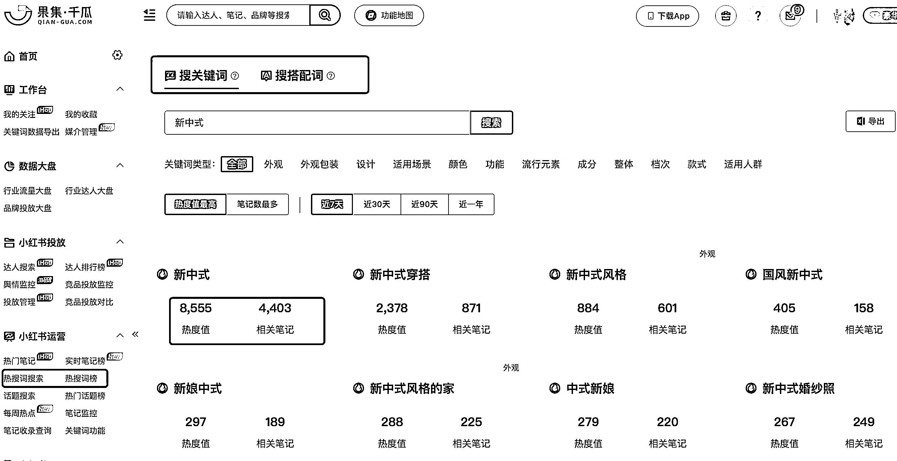
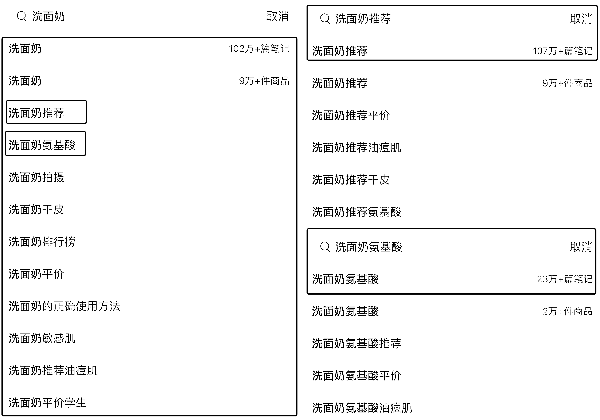
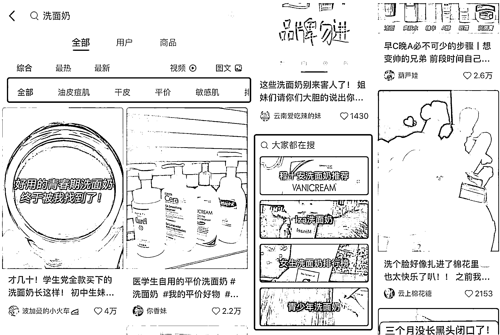

# 7.3.4.2 关键词挖掘方式

1）第一种：聚光平台关键词规划工具

聚光平台的关键词规划工具非常好用，你可以从笔记推词、以词推词、上下游推词、行业推词等五个维度来选词。

比如以词推词，输入你想要的关键词后，它会给你推荐蓝海词、同行买词、黑马词和高点击词，其中蓝海词和黑马词都是竞争力小，需求量又大的好词。

因为聚光平台是官方平台，统计出来的数据相对都是比较精准有效的。

但缺点是，目前只有企业号，并且是已经认证开通广告功能的企业号，才能登陆使用。

2）千瓜数据

千瓜是专注于小红书的数据分析平台，里面的关键词排名、对比和下载功能也很齐全。

点击左侧工具栏“热搜词搜索”，输入你的关键词，会出现很多关联关键词，每个关键词还有热度值和笔记数量。

大家可以自己做个表格，记录下各个关键词的数据，用热度值除以笔记数量算出比例，找比例值大的，因为搜索的人多，竞争压力又小，适合作为目标关键词。

再比如有“热搜词榜”，可以看到热词增量榜、总量榜。

两个搜索方法都可以直接导出，非常方便统计整理。

但缺点是需要收费，会员价一个月好几千，对普通人来说成本有点高。

3）小红书平台

这是一种免费的挖词方法，但需要你花一些时间去挖掘。主要途径有以下三种：

① 搜索栏下拉框

在小红书搜索页，直接输入你要搜索的关键词，比如“洗面奶”，下方会出现一长串的关键词。

这些都是系统根据近期搜索频率，总结出来的关联关键词，挑选自己适合的去铺就可以。

有的时候，我们也需要做取舍，比如“洗面奶推荐”和“洗面奶氨基酸”，到底选哪个？

一般来说，越靠前的词，热度越高，也就是说搜索“洗面奶推荐”的人比搜“洗面奶氨基酸”人更多。

但是当你把两个关键词分别输入搜索栏，下方会出现相应的笔记数量。

显然，“洗面奶推荐”虽然热度更高，但是平台已经有 107w+ 笔记，竞争压力大，而“洗面奶氨基酸”只有 23w+，竞争压力小很多，更适合我们去布局。

② 搜索结果页面

输入关键词后，点击进入搜索页面，你会看到有很多地方出现关联性的关键词。

一个是顶部的标签栏，会显示一行和搜索词相关的词，左滑还可以看到更多，可以选几个和你的搜索词组合使用。

还有一个是浏览页面往下拉，页面会出现一栏“大家都在搜”，这个不仅可以作为关键词使用，还可以作为笔记选题来做。

③ 标签浏览量

一般笔记的文本框都会加话题标签，点击进入话题，可以查看该话题的浏览量和相关笔记。

大家可以去同行的笔记页面进行统计收集。

以上就是常用的几种挖词方法，通过这些方式找出来的词，都比较客观，而且是经过验证的，避免了自己臆想造词却没人看的局面。

找到了关键词，接下来就到了关键步骤：如何正确布局关键词。

