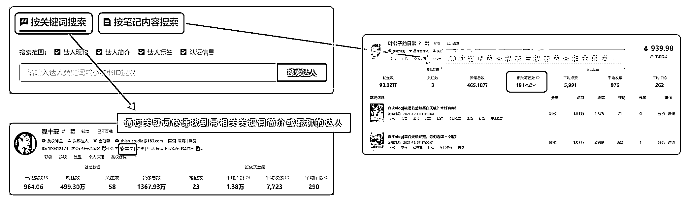

# 7.4.2.1 强关联内容达人的查找

1）通过达人特征找达人 — 分类标签查找

达人创作的每一篇内容，都会被小红书打上分类标签，如果达人持续性的输出某一类内容，则整个账号都会被打上某一标签。

小红书会根据达人的账号标签 ，推荐内容给相关的粉丝，粉丝的垂直度越高，流量越好。点击千瓜数据“ 达人搜索 ”栏目，可看到千瓜根据文章类型 统计出的 分类标签 ，直接筛选找到满足条件的行业达人。

2）通过达人特征找达人 — 多维筛选条件

搜索出达人后，需要进一步分析达人的账号质量，有以下 六个维度 可供参考：

•观察达人的 整体数据(平均数、中位数），看是否符合基本数据要求。

•观察达人的笔记类型分析，判断达人 擅长的内容分类 (笔记分类占比高，笔记分类互动量占比/笔记分类占比＞1）。

•观察达人发文的平均“赞藏”表现，如果 走势相对平稳 ，则说明粉丝相对稳定。

•观察”粉丝分析”中的“活跃粉丝占比”以及“水粉丝占比”，千瓜通过分析粉丝在小红书的互动行为，综合计算出该项指标，能反映出达人的粉丝质量。

•观察达人的新增数据表现，判断达人的笔记更新频率，以及同相近粉丝量级区间的达人在同一时间段内的点赞增量水平的表现。

•数据真实性。笔记内容是否重新编辑过，且与笔记标签是否严重不匹配（可能为笔记内容替换）。

3）通过达人特征找达人—多重检索模式

针对不同的搜索需求及应用场景，有针对性地使用不同的检索模式，更加精准地筛选达人。

•按关键词检索：通过昵称关键词以及丰富的筛选条件快速锁定目标达人。

•按笔记内容检索：比分类标签更加精细的检索，直接锁定达人笔记内容中的指定关键词。

4）通过粉丝群体找达人—粉丝标签筛选

达人是粉丝的聚焦点，找达人就是在找粉丝，选择符合品牌调性的达人尤为关键。 千瓜分析了达人的粉丝类型，归类了数十个人群标签，可在“达人搜索”中点选粉丝人群标签，定向找到目标粉丝群体覆盖的达人。

5）通过粉丝群体找达人—粉丝焦点及人群分析

点击进入达人分析，可在右侧“粉丝分析”中进一步查看粉丝的关注焦点、粉丝人群标签，以及粉丝画像的基础数据包含性别、年龄、地域、活跃时间等，有利于进一步判断粉丝是否符合投放的需求。

6）通过粉丝群体找达人—粉丝互动偏好分析

通过 AI 建模分析，千瓜可分析出达人粉丝在整个平台的互动偏好，方便了解达人粉丝并筛选出更多同类型账号。

•笔记分类偏好：汇总达人粉丝发布的笔记类型，直观了解达人粉丝的喜好。

•互动偏好：粉丝互动评论的笔记中提到过高频词汇，了解粉丝在平台上的关注点。

•品牌偏好：粉丝发布的笔记以及互动过笔记中提到的品牌信息。

•关注的达人偏好：汇总分析粉丝除当前达人外还关注了哪些类型的达人，达人粉丝区间以及赞藏区间。

