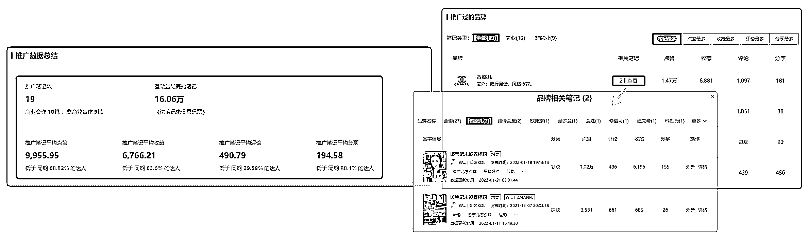
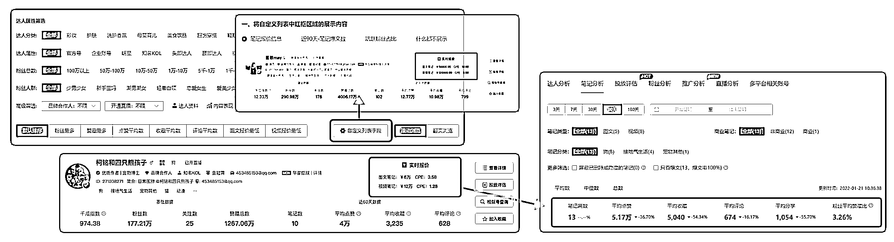

# 7.4.3.2 商业力强的达人

1）调性契合度

选择契合品牌的达人进行合作 ：

•产品契合：产品适合达人及其粉丝群体，更容易进行种草。

•达人共创：尊重达人账号的调性，融合自身人设与品牌的特点，沿用日常的表达方式进行种草。

一款低卡饱腹、健康美味的酸奶果粒麦片产品想要找与品牌契合度高的达人。

分析达人“樱桃叽歪酱”近半年的笔记分类，美食相关的笔记高达 80% 以上；其粉丝关注的焦点大部分在美食教程、正餐、减肥运动上，由此可见，这位达人与该产品调性基本契合。

另外，该达人 80% 以上的笔记为美食教程类视频，该酸奶品牌可以延续达人账号风格，将产品植入到美食教程中。

2）推广品牌

通过达人详情-推广分析，直观查看达人近期的推广数据总结，进而判断达人种草效果是否与日常发文水平差距过大；推广分析下方的品牌列表，可查看达人近期具体种草的品牌及具体的互动数据。

复投率也是判断达人商业力的因素之一，相关笔记显示品牌与达人是否多次合作，可见品牌对于达人的认可度很高。

3）报价和 CPE

报价和 CPE 在衡量达人商业力中也是非常重要的一环。报价适中，CPE 越低，互动效果越好，达人的性价比越高。

点击自定义列表字段，选择展示笔记报价信息。可直观看到每位达人的笔记报价和 CPE 值，将有意向的达人加入收藏，再进一步查看达人的平均互动量数据是否达到正常水平。

*（CPE 单个互动成本=投放金额/总互动量）

