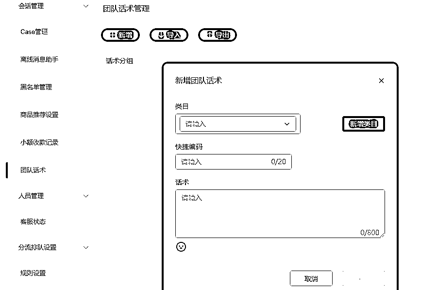
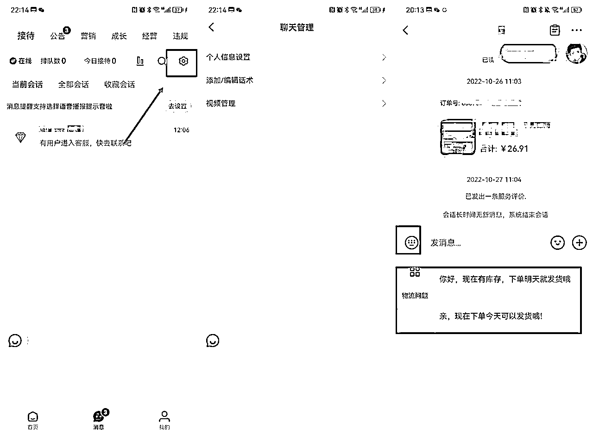
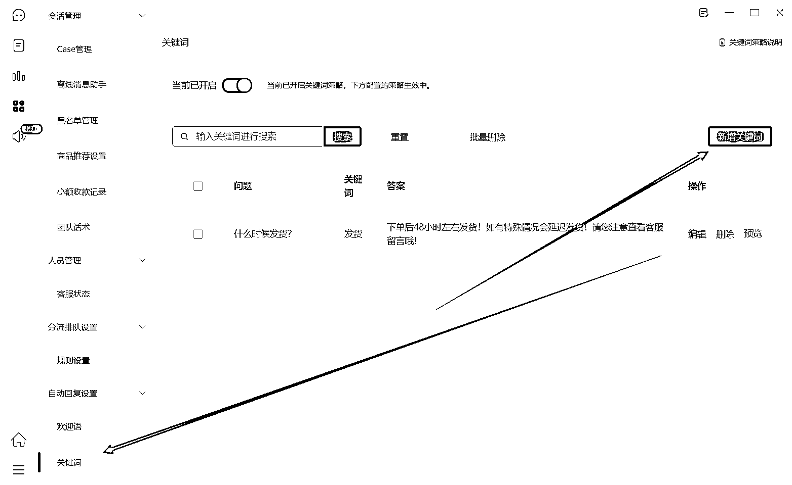

# 8.1.1 客服管理

在小红书商家 app 里把应用声音提醒打开，只要有客户咨询，就能收到声音提醒。平台会考核客服回复率（回复率≥80%），如果回复不及时店铺评分会下降。

考核详情如下表：

处罚方式：限制店铺及专业号公域流量 3 天，该处罚不支持申诉。

处罚通知方式:每自然周周二，平台将通过商家运营系统 > 站内信、小红书商家版 App > 消息、小红书用户版 App > 消息通知，三个渠道推送通知商家。

除了客服考核外，小红书官方还会有服务行为抽检。商家在服务的过程中，有违规情况，小红书官方也会对商家做出惩罚。具体违规详情和对应处罚方式见链接第七条：[小红书商家自主客服服务管理规则](https://school.xiaohongshu.com/rule/detail/5d6934fd0000000000000000/63478e33fdaaa1a06d5fa4a5?entry=00020000&jumpFrom=customer)

提高客服回复率的方法：

1）设置团队话术

小红书的用户有的关注非常多的人，加入很多的群，如果你没有及时回复，后面她可能就看不到信息了，所以尽量及时回复。

可以把经常要给客户说到的一些话设置成话术，这样子避免下次再打字。比如客户问到发货、库存等物料问题，就可以把发货、库存相关的问题解法设置成话术。下次就可以快捷编码，编辑为物流问题，那下次物流问题就是代表这个话术的快捷方式。

如果回复以后，客户一直没回复的，可以把用户昵称记下来，可以去看一下评论区，或者是新增关注有没有这个人，或者去搜索私信，但是小红书的昵称重名很多，找到的几率会比较小，而且比较耗费时间。

2）设置自动回复

小红书商家 app 里面有可以设置自动回复，触发设置关键词就自动回复。可以针对用户常见问题，设计好快捷回复话术和视频。

以鞋服类目为例，对尺码、款式、是否有货、是否正品、是否支持退换等售前问题设置回复话术，提高客服接待效率。

如果不会写话术，可以伪装成顾客，到同行店铺咨询相关问题，套出回复话术化为己用。

3）刷回复率

如果自己有多个账号，可以使用其他账号充当客户，来找客服沟通，这样回复快，提高回复率。

如果自己没有多个账号，可以请群内的朋友们互相咨询提高回复率。

