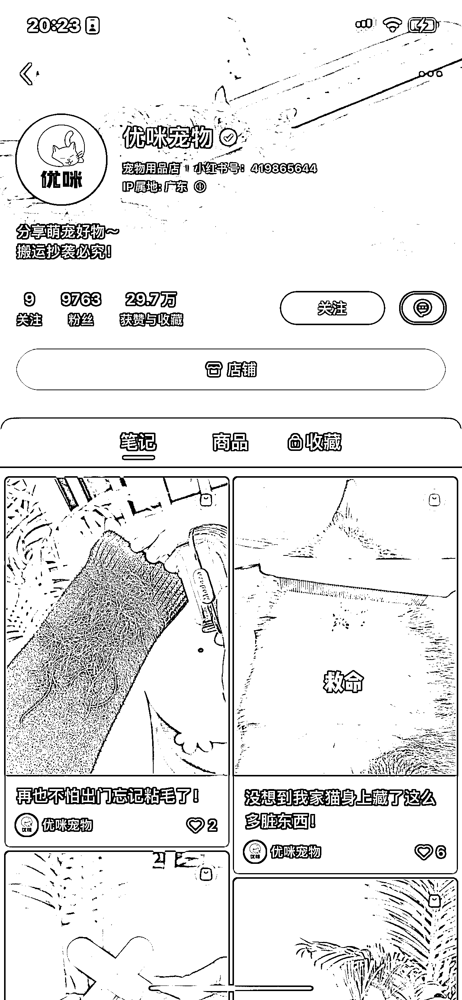
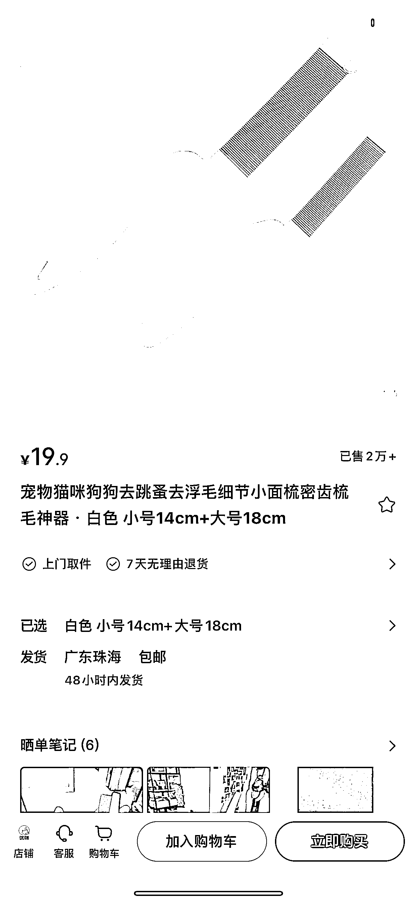
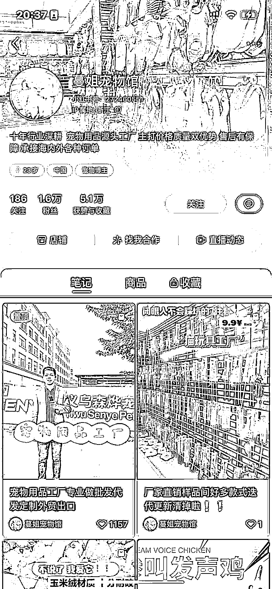
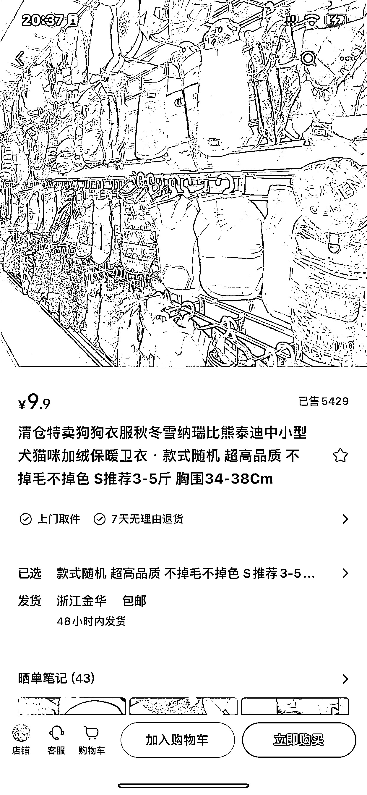
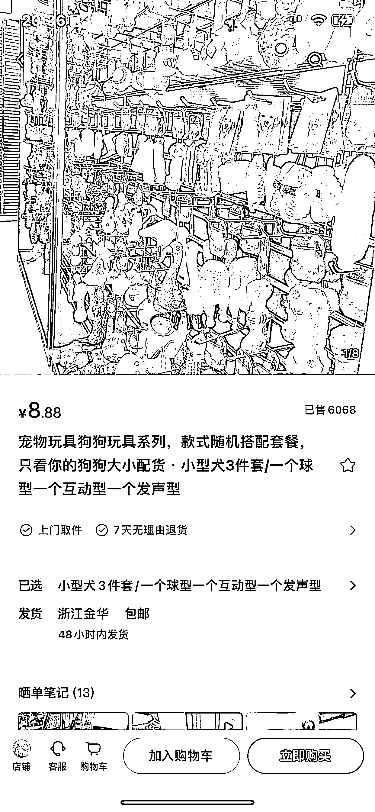
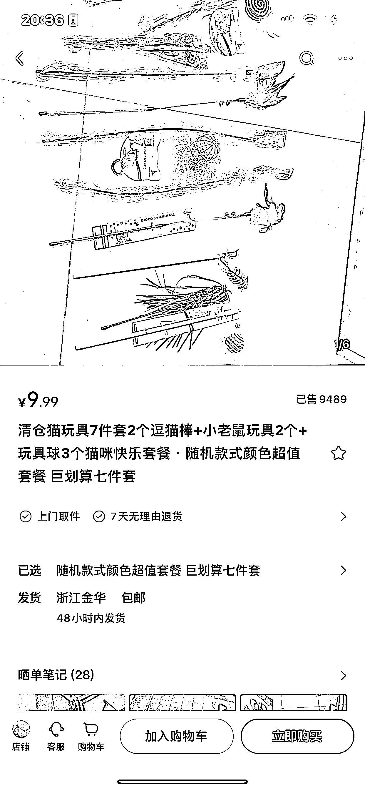

# 赛道十：宠物用品

1） 案例信息

•账号名称：优咪宠物

•店铺名称：优咪宠物的店

•案例链接：[`www.xiaohongshu.com/user/profile/5c18ddca0000000006013f74?xhsshare=CopyLink&appuid=639a89460000000026012bb6&apptime=1676723063`](https://www.xiaohongshu.com/user/profile/5c18ddca0000000006013f74?xhsshare=CopyLink&appuid=639a89460000000026012bb6&apptime=1676723063)

•案例选择原因：销售额相比较其他，排名靠前，产品有明显的爆款，单品销量 2W+，场景生活化，拍摄难度不高

2） 流量来源

•内容形式•内容载体：视频为主•内容分析：内容简短，拍摄简单，任何养宠物的都可以模仿，有爆款产品，可以模仿，还没有特别多的竞品，上升空间大，切中用户刚需，比如：粘毛，也可以切中其他的宠物用品需求，比如：猫窝等

•流量渠道：发现页+搜索流量

•获取方法：宠物用品里面的垂直内容，主要围绕粘毛和干燥剂，深度解决用户需求，相同类型的产品重复发

3） 变现产品

•形式：实物视频和生活场景相结合

•品类：宠物用品

•货源/渠道：自营或者代理

•价格/销量：20-100 左右，销售额 100W 左右

4） 相似案例

宠物的玩具也是刚需，这些产品是非标品，更容易复制和模仿。

