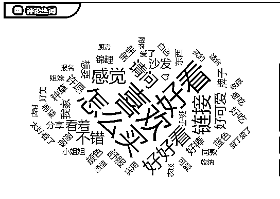

# 1.5 变现方式 @谢无敌

根据 QuestMobile 2020 年的数据，小红书平均带货转化率为 21.4%，而抖音、快手和微博的转化率分别为 8.1%、2.7% 和 9.1%。

正是基于平台里有一群喜欢“买买买”的用户，以及天然的“种草”社区属性，小红书的带货转化率比很多公域平台都要强：

而这一点意味着，商家爱在这里引流、投放，吸引精准客户；博主（即便是素人博主）也有更多机会变现。

根据销售属性不同，小红书变现方式大致可以分为以下两大类：

一类是卖东西，自己有可销售的产品、货源或服务，包括实物产品和虚拟产品，比如资料、课程等等。

简单来说就是，博主本人有商品可以卖。这种类型的小红书账号，我们一般叫做商家博主。

另一类是卖时间，自己没有商品，想通过小红书增加收入。

通常是把小红书当做副业去做，当然也有全职做的，比如一些宝妈，通过接广告或者卖别人的产品变现，我们称之为纯博主。

那接下来，我们就从这两大类展开，分别讲一讲都有什么样的变现渠道。