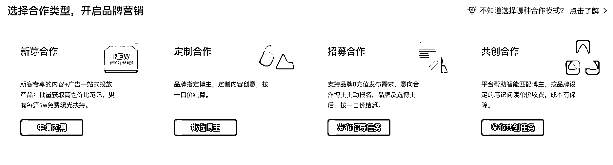
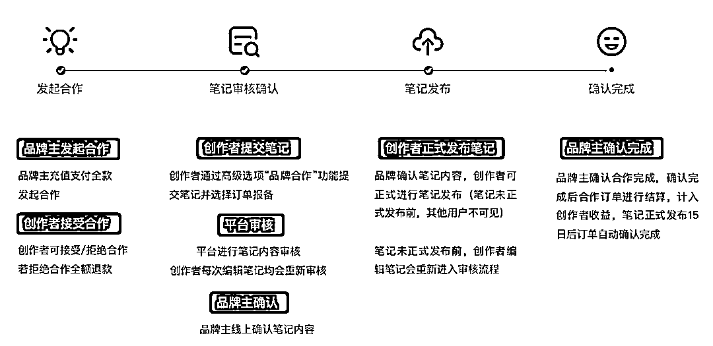
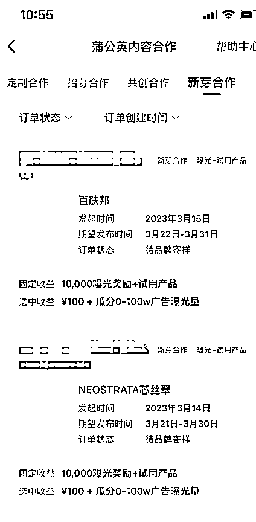

# 1.5.2.4 成为品牌合作人 @大芝

正规的合作方式，就是入驻蒲公英平台，成为品牌合作人，入驻门槛是完成专业个人号认证，并且粉丝 1000 以上。

1) 入驻蒲公英平台

目前小红书也在大力支持低粉博主变现

积累 1000 粉丝之后，就可以申请入驻蒲公英。

目前蒲公英分别有四种合作模式，如下：

正常来说合作流程见下图：

因为是官方合作渠道，所以足够安全保险，缺点是需要扣除 10% 的平台费，且入驻有门槛。

2）定制合作/招募合作

都是一口价广告，广告报价是你粉丝数量的 10%。一千粉丝，就是 100 块一口价。

3）共创合作和新芽合作

对低粉博主更有优势的是共创合作和新芽合作：共创合作能拿到更多的钱，新芽合作能拿到更多流量。

共创合作除了一口价以外，视频互动数据好，还可以拿到更多广告提成。

两点提醒：

•共创合作一个广告可以关联 3 条笔记，分别都计算提成，大家如果拿到共创合作，一定把 3 条笔记都堆满，每条笔记都能拿广告提成，增加收益。

•共创广告提交笔记时间和统计提成的时间是不同的。

我第一条共创广告计算提成时间截止到 3 月 10 日。

我错以为笔记发布时间也是 3 月 10 之前。但实际笔记提交时间是 3 月 2 日截至。时间记错了，导致广告关联失败。

后来我把这篇笔记的广告部分删掉发布，结果数据跑得比关联了的那篇还要好，错失了 2000 块的广告费，损失惨重。

新芽合作，除了一口价以外，还会获得额外的流量推广，增加曝光度。好处不言而喻。

新芽合作的广告很多，报名也很容易通过，所以大家报名的话注意排期。我刚开始不懂，一口气报了太多，集中通过了 5 个，档期有点排不开了。

