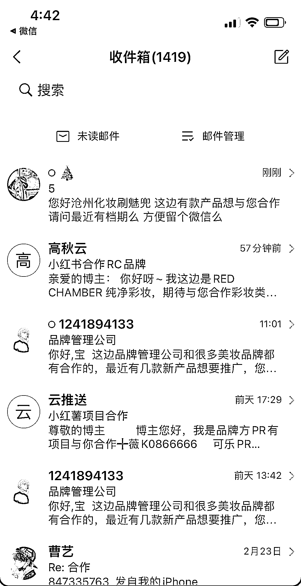

# 1.5.2.5 邮箱广告邀约 @大芝

除了官方蒲公英接广，还有很多是通过邮箱加过来的广告。避开平台接广，可以省掉平台 10%的抽成，合作报价实给。但对博主和品牌来说都少了一个第三方背书，存在一定风险。

不过特别需要提醒，在个人简介里放邮箱本质上是引流行为，有可能被官方检测到。粉丝少的时候如果留了邮箱，尽量就不再要频繁更改简介了。

我简介里原本一直写着邮箱，都没有问题。但视频爆了以后，我手贱去修改简介内容，提交后重新审核，就触发了检测机制。判定我有引流行为，简介清空。因为每周只能修改 3 次简介，而我的次数已经用完，所以这个周简介就空窗了，隐形损失掉一部分可能通过主页关注的粉丝。

内容来源：《低粉变现+打造爆款视频的秘籍》