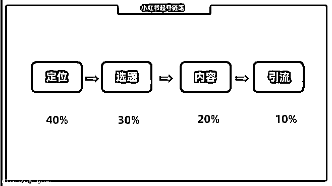

# 2.1.2.2 寻找赚钱定位的核心原则 @吴一村

V 先生说过一句话：“定位是 1 ，其他的事情都是后面的 0 。瞎写也有复利，但写一段时间，你会发现难赚钱，慢慢就没有信心继续写了。”

所以做小红书核心一定要做一个赚钱的账号， 否则，大概率你会半途而废。而做一个账号最重要的前提，是你要做一个赚钱的定位，一个赚钱的定位就决定了这个账号变现能力强弱。

在前期，40% 的精力要放在定位上，其次才是选题、内容、引流。

要做一个赚钱的小红书账号，你就要明确这 2 个核心原则：

1、痛点 >> 痒点

在有多种定位选项的时候，能选择解决痛点需求，就不要选择解决痒点需求。因为大多数人，在痛点的消费上是毫不手软的，但是在痒点的消费上是“唯唯诺诺”的。

比如职场领域，大学生群体最痛的点是什么，如何快速找到好的工作？找到工作是一个核心需求，但里面包含太多的细分需求，比如简历优化、面试指导、入职体检、能力培训等等。

相对于体检、培训，大学生是更愿意为简历优化和面试指导去付费的。在众多需求中，我们要专注里面用户更愿意付费的痛点需求，吃透它就可以，与用户建立信任感最快，离钱最近。

2、帮助别人赚钱 >> 帮助别人成长

每个成年人进入社会后，就不再是个学生了，单纯的学习成长的重要性会降低，赚钱成为了成年人最重要的事情。如果你靠技能赚到钱、做项目赚到钱，做自媒体变现等赚钱相关经历，最好的定位选择帮助别人赚钱，而不是帮助别人成长。

在定位时最好明确这两个核心原则，尽量选择痛点 >> 痒点，赚钱 >> 成长，如果脱离基本原则，就不能击中用户最痛的点和需求，那和用户建立信任缓慢，变现起来路径比较长。

注：以上两条原则，针对的是新人，而非领域专家。任何一个领域，只要你成为了专家，那都是不愁赚钱的。

内容来源：《14 天从零变现 1000+，适合新人的小红书赚钱定位攻略分享及避坑指南》

