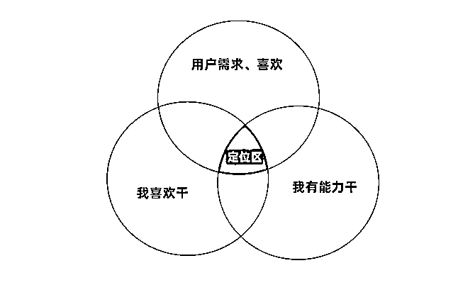

# 1）自身具备的、符合用户需求的兴趣、技能 @吴一村

剖析自己，你要明确你能分享的内容是什么、属于哪个领域。比如，一位 90 后的孩子母亲，有两个孩子和 5 年人力资源职场经验，赛道既可以选择母婴，也可以选择职场。

此时这位小红书新人该如何定位呢？

深度认识自己，找到自己所热爱的、立足能干的内容领域。假设这位宝妈热爱人力资源管理工作，并且有多年来内容积淀，那她的用户群体可以是 0-5 年职场经验的用户。但如果她对这类内容完全无感，即使有积累，也很难做得出色，也难以持续，那不适台把职场作为定位了。

喜欢是好事，并这不代表你能胜任内容输出，所以还要在自己在有能力干和用户需求中找到一个聚焦点，这个点才是好的定位。

很多新人定位都是直接找自己喜欢做的事，觉得别人做这事能成功，自己肯定也能成功。但是做完之后发现数据反馈很差，这是因为用户只关心她自己，你喜欢的不代表别人也喜欢。所以我们一定不能自嗨，一定要关注用户的需求。

除了挖掘自己喜欢、有能力干、用户需求的事情外，最重要的是要以此来定技能。

什么叫定技能？就是你会的，你擅长的一项东西，你可以很轻松容易地分享给他人。

比如：摄影技能、美食营养技能、健身、赚钱技能等等。

内容来源：《14 天从零变现 1000+，适合新人的小红书赚钱定位攻略分享及避坑指南》