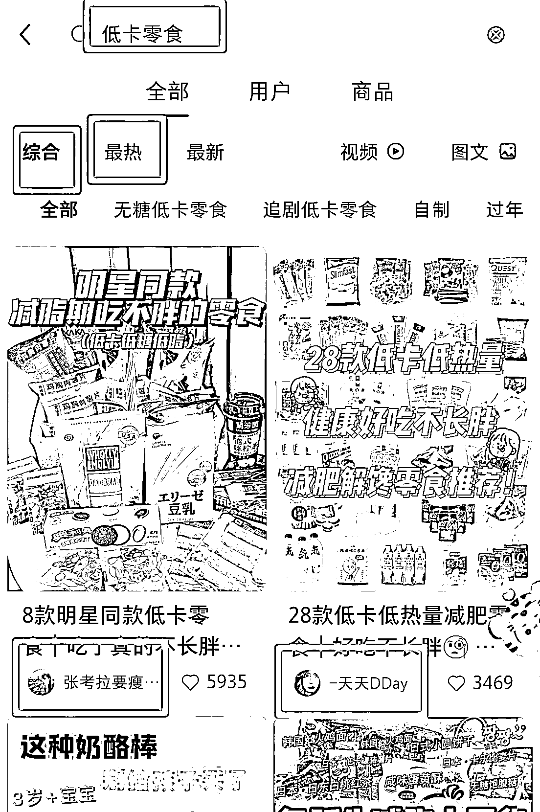
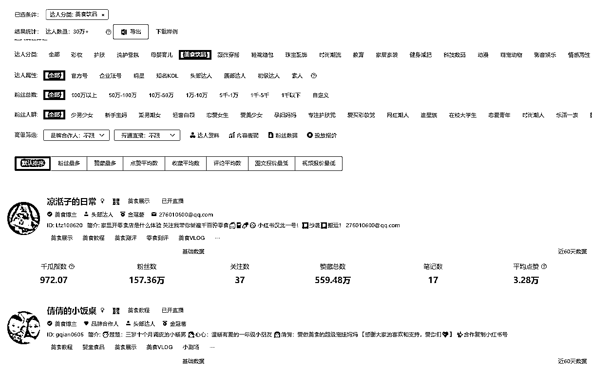

# 2.3.1 找对标博主的方法推荐

1）搜所属领域的关键词（最好用）

在搜索框搜自己领域的关键词，然后查看综合和最热里的排名靠前 50 的博主，筛选合适的对标。

2）点击【频道】的对应类目

小红书二级导航有家居、美妆、穿搭等多个频道，你点击对应领域的频道，可以看到该领域下的博主的笔记，从里面筛选适合的对标博主。

3）千瓜、蝉妈妈等第三方工具

第三方数据工具一般都有达人榜单和达人搜索，按分类、账号属性、粉丝级别等筛选，比较便捷，就是价格偏贵。

4）主页推荐页

你经常看哪个领域的笔记，系统会根据你的兴趣爱好和阅读偏好，推荐对应领域的博主的笔记给你。

