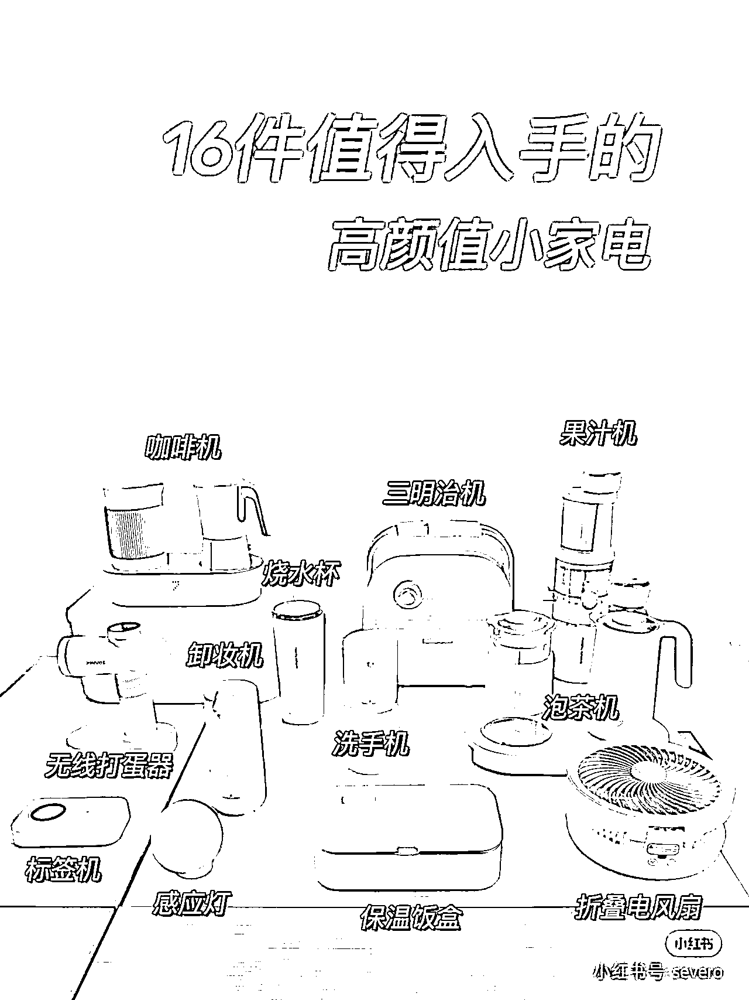

# 3.2.2.1 合集类笔记

•难度：1 颗星（非常容易）

•适用人群：全部类目通用，好物和知识 IP 都可做，尤其适合好物 IP

这是小红书里最容易起量的笔记类型，主要特点是，数量多而全、「怼量」，记得在首图上突出这一点，标题多用数字冲击，用户会爱看。

合集笔记一般这么写：将同样风格特点、功效功能、针对人群、场景的物品放在一起推荐。每类产品都要展示和总结描述它的特点风格、使用体验。

•首图特点：多个物品摆在一起实拍，或者拼图，每个物品标记下名称或价格，图片核心在于凸显“多”。

•对标笔记：

[《618 购物清单🧾值得入手的高颜值小家电》](https://www.xiaohongshu.com/discovery/item/60bb03a600000000210383e2?xhsshare=WeixinSession&appuid=60059a990000000001006ec4&apptime=1642411998)

[《吃货减脂必囤低卡零食❤好吃不贵😝不长胖》](https://www.xiaohongshu.com/discovery/item/5f7e7a40000000000101c0e7?xhsshare=WeixinSession&appuid=60059a990000000001006ec4&apptime=1642412334)

[《收藏慢慢看！真正 50 款平价好物大合集，别错过》](https://www.xiaohongshu.com/discovery/item/6189eefc000000000102a457?xhsshare=WeixinSession&appuid=60059a990000000001006ec4&apptime=1642411908)