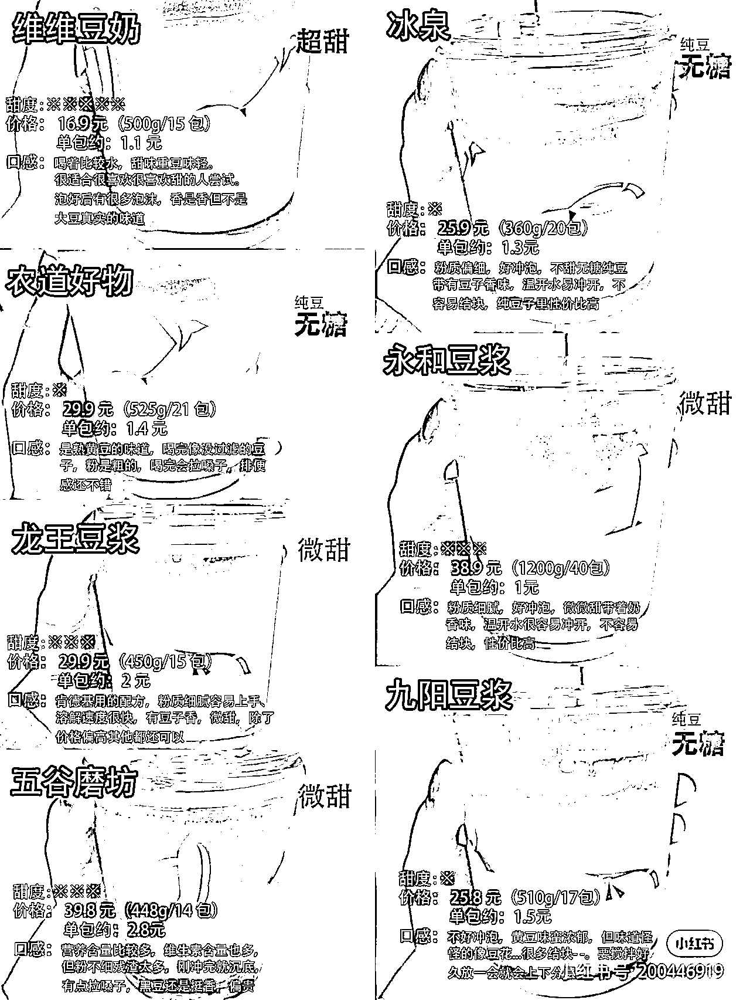

# 3.2.2.2 测评类笔记

•难度：2 颗星

•适用人群：更适合好物类 IP；如涉及知识类产品测评，知识 IP 也可少量做。

跟合集有点相似点，但合集笔记一般倾向于全部都推荐，而测评类笔记一般会有“红黑榜”或星级评分，对产品好坏进行区分。

笔记内容一般包含 3 个部分：

场景引入——每个产品的体验描述——总结产品红黑榜/适用人群分类/不同维度的星级评分

•首图特点：红黑榜对比类首图；或合集类首图上添加标识区分不同产品的评分或适用人群。

•对标笔记：

[《成都重庆攻略❗红黑榜教你避雷👭旅游必备》](https://www.xiaohongshu.com/discovery/item/5f49011e00000000010062b8?xhsshare=WeixinSession&appuid=60059a990000000001006ec4&apptime=1642413120)

[《【豆浆粉测评】大户人家系列第十三期》](https://www.xiaohongshu.com/discovery/item/617ea001000000000102717a?xhsshare=WeixinSession&appuid=60059a990000000001006ec4&apptime=1642414617)