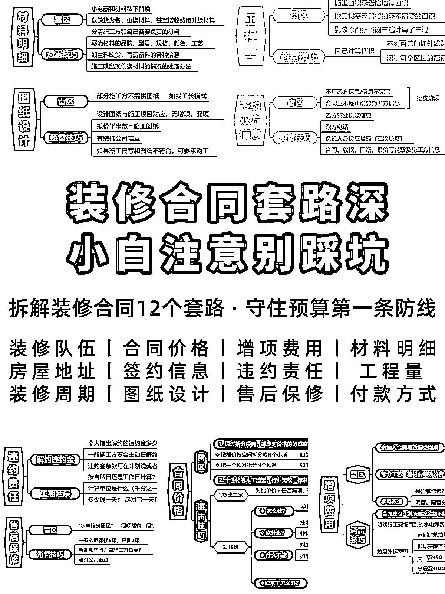

# 3.2.2.4 避坑类笔记

•难度：2 颗星

•适用人群：适用于全部类目，好物带货和知识付费 IP 均可做。

避坑笔记可以是纯文字描述，也可以图文并茂，前者简单一些。内容架构有两种写法：

1.直接盘点总结大家最容易踩的坑、千万别做哪几种事；

2.先盘点总结雷区大坑，给出正确的做法。

•首图特点：纯色图/实拍图/网图都可以，图上要加标题花字突出主题。

•对标笔记：

[《装修合同避坑指南❗看清装修公司套路省几万》](https://www.xiaohongshu.com/discovery/item/5eb3ea0d0000000001001eeb?xhsshare=WeixinSession&appuid=60059a990000000001006ec4&apptime=1642415826)

[《避坑！这些野鸡设计比赛别再参加了！》](https://www.xiaohongshu.com/discovery/item/616cf8d300000000010259de?xhsshare=WeixinSession&appuid=60059a990000000001006ec4&apptime=1642416069)