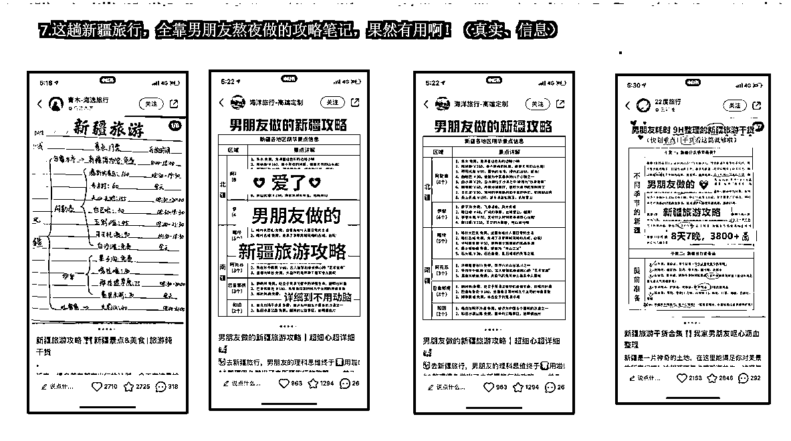

# 3.3.5 通过对标账号中的笔记中挖掘 @许义

通过分析对标账号的爆款内容进行选题，是比较便捷的一种选题方式。

通常来说，火过的内容会再火。所以在日常生活中，我们可以做一个选题的藏宝图，对每个选题的成功性打分，最终来确定优先做哪个。

给大家看几个通过这种方法确定选题的案例：

由于是根据已有的爆款内容来确定选题，所以有时是需要我们适当放弃自己的特色和想法，很多时候，你忙了一下午的原创，可能抵不上一个火过的爆款再发一次。

所以制定爆款选题的藏宝图，把火过的内容、容易引流的内容排着顺序发：

内容来源：《小红书 3 天新号粉丝破千的运营方法论》

对于一些小众领域，会出现一种情况：就是该领域下火过的内容，由于关注的人不多，笔记的数据也不会很高，这个时候怎么判断是否可以作为自己的选题呢？

圈友@杨星城 提供了一种方法，以下是他的原文：

找到你的对标账号，然后看他们做什么选题是爆款的，就往这个方向去创作新内容。

那什么才是爆款呢？难道千赞万赞就是吗？

不一定，如果一个账号 60 万粉丝，他一篇笔记千赞以上，其实都不叫爆款。我觉得大家可以通过以下这几个角度做定义爆款：

1）点赞数比粉丝数要多的 2）找 3 万粉丝以下有千赞的作品 3）万赞以上发布时间在 30 天内的

也可以做一下选题的计划：

找到 3～5 个对标号，粉丝数都在 3～5 万以下的，然后每个号找出 3～5 个爆款选题，这样你就差不多有 10～20 个题目了。

内容来源：《小红书日引流 200+，简单粗暴！从博主玩法迭代矩阵玩法 2.0 版》

