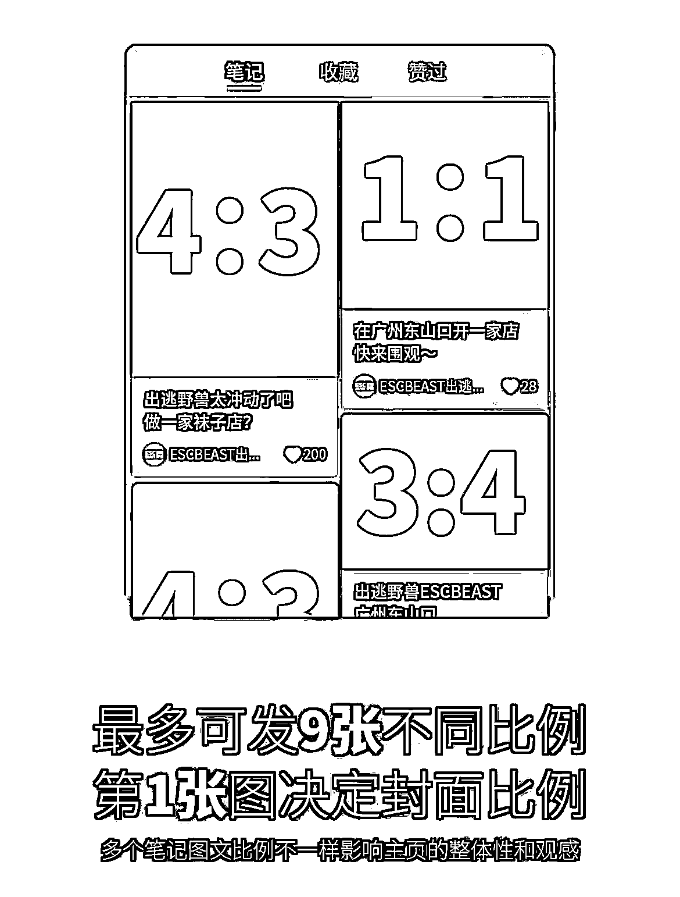

# 3.4.2 一张优质封面的共性

在大多数时候，笔记的封面要么得特别好看，要么能清晰传达主题或吸引人的点。

优质封面的共性如下：

•主题明确、突出重点（真人、真实场景比纯产品抠图效果要好）

•画面清晰、明亮、简洁，避免杂乱

•配色保持和谐统一，不要花里胡哨

•标题文案简单明了，不要过长、字体字号尽量统一

•比例统一：推荐比例 3:4（竖屏）比较容易霸屏。想精致一点的 4:3（横屏），比如电影类、vlog 类

内容来源：《航海实战｜小红书-合集带货｜实战手册》

