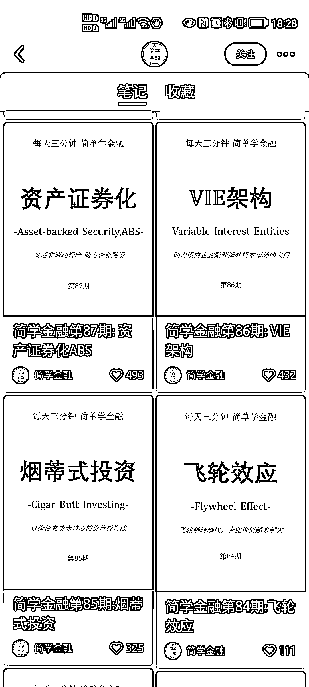

# 3.4.3 封面制作 @Enda 九七

PPT 制作封面图，是一个简单高效的制作方法。小红书用户的审美还是比较高的，所以首图要比其他屏重要的。

但如果每次使用不一样的封面，P 图又太费时间了，所以我们可以借助一些工具来制作，例如 PPT、稿定设计等。我写种草笔记的时候就会使用的稿定设计，做出一个模板保存，后续只要套模板就好了。

如何提高效率：简单来说就是拥有一个模板，后面不停的套模板。简单的就是美的，推荐大字报模式（梨云绿这种）

这种封面做起来真的简单，我是先用 PPT 存好一个模板，然后每次改一下标题或者图标就好了，效率杠杠的。

内容来源：《不懂流量的新手：怎么从零开始到接 3 个小红书商单》

