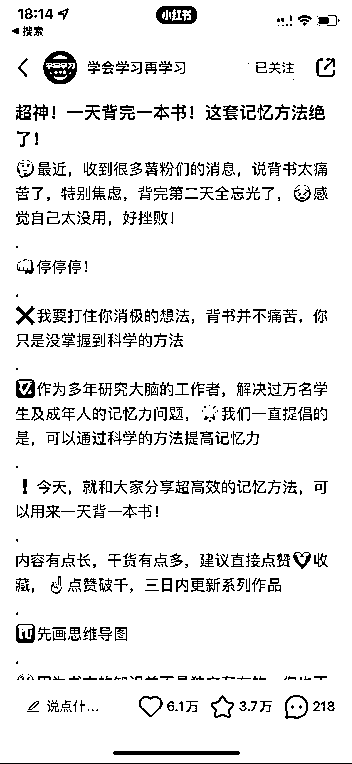
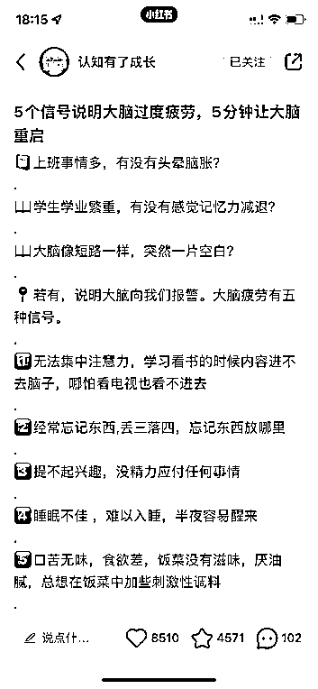

# 3.6.1 开头格式

痛点引入+情景描述+人设+方法介绍+点赞诱导

一定要记住这个格式，其实，小红书上 80%的笔记都是这个套路：

举个例子，如：记忆力差

很多同学花了 1 个小时去背书，但就总是背不下来，而且越背越没自信（痛点引入）
明明自己很想努力，但书本堆得像山那么高，都快背哭了还是记不住（情景描述最好能引起共鸣，你的案例相当是用户的案例）
作为多年研究学习方法的教育工作者（人设辅助），今天就和大家分享 xxx 方法，超级干货有效（方法介绍），建议直接点赞加收藏，方便后续反复查阅（引导点赞）