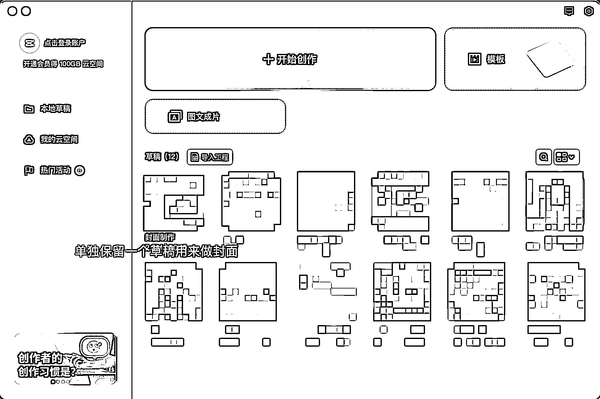
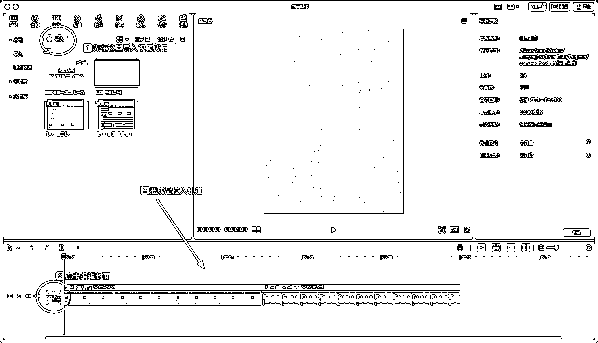
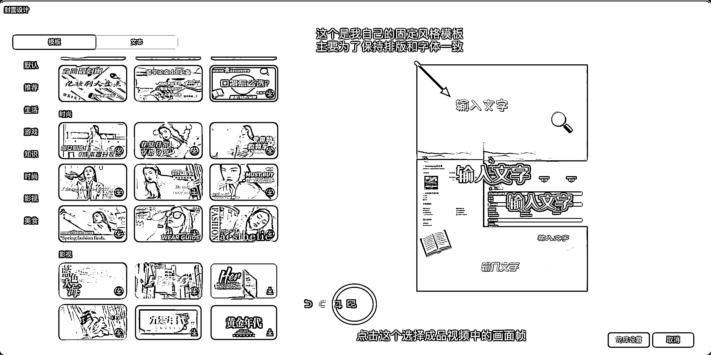

# 3.7.3 视频笔记的实操建议 @Zora。 卓然

1）能搭框架就不要弄逐字稿

人的语言表达系统里，口语习惯和书面习惯是不一样的，一旦写了逐字稿，录视频的过程中你就会拼命回忆自己写好的内容，过程会变得很生硬，像在背书

我的经验是最好不要写逐字稿，简单梳理出你要讲的内容，会有些什么例子，得出什么结论，然后再根据框架输出，效果会更好（分享一个日常搭框架的草稿）

2）一镜到底，不要 NG

我的第一个视频，光是第一段就录了二三十次，因为面对镜头，开始会不自在有各种各样的状况，但后来发现真的没有必要。

如果一直从头再来，就会像背单词一样：abandon abandon，最后发现录不下去，就真的 abandon 了

更好的方式是，强迫自己一镜到底，说错了镜头不 NG，但你可以自己再讲一遍，这个过程你会渐入佳境。

摒弃反复点录制按钮带来的压力，开头那关过了其实就讲顺了，中间讲错了也无伤大雅，就跟我们平时对话一样，说错了就改口就好。

可能有小伙伴会说，那我剪辑的时候不就很累？ 要一直反复听，听自己到底哪里开始讲错了。

剪映现在也有智能口播的功能，可以直接识别出视频当中的停顿、语气词，一键完成粗剪，效率很高。

3）多找多拆解对标博主的视频

我在没有开始做视频之前，也觉得视频很难。但真正去拆解一些博主的早期的视频之后会发现，大家都是从上面几种简单的开始做起的。

不要去惧怕自己的能力不够，既然我们做的是成长型 IP，能被你吸引到的粉丝看上的大概率也不是你在这方面有多么高超的技能。

他们看中的是你成长的过程，你的观点、你的思考、你进程中遇到的问题和解决的办法、你一步一步的成长和进步。视频只是一种形式，并不是比拼你我谁剪得更牛的作品。

4）保留一个制作封面的视频草稿

为了能够在每次剪完视频后，快速产出同类风格的视频封面，我的剪映中保留了一个视频草稿是专门用来做封面的，相当于封面模板。

具体的实操步骤，就是每次剪完视频之后，把成品视频导入到制作封面的草稿中，然后点击制作封面的【编辑】图标——选择【重选封面】——任意选择一帧画面——会保留你原来模板中的字体、排版、icon，只需要修改标题即可得到一个风格统一的封面——最后【完成设置】

这个小技巧不是说非做不可，只是我自己觉得用户点进主页看到统一的模板，会觉得更舒服。

而且保留这个习惯我就不用额外去记不同字体的参数，能提高我做视频的效率。

内容来源：《如何在快速在小红书打造 50 万的视频爆款，以及快速增粉》《新手起号也能做的视频笔记》

