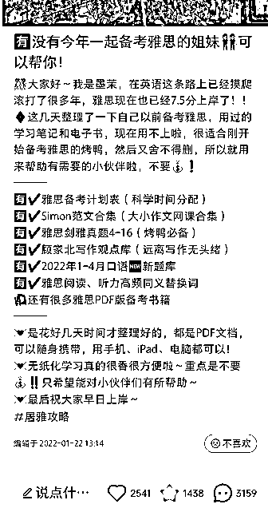

# 3.8.2 「 40% 的笔记」写容易爆，但不容易触发用户付费的内容

这类笔记的作用是，引爆流量，把另外的 60% 笔记带火，同时让小红书官方认为，我的号不是一个只会卖货的营销号，我还是在给这个平台的用户提供价值。

2）专业领域的内容

也就是我手把手教你做包子呀，面粉要怎么混合，揉面要怎么揉等等。这样的干货类内容发布以后，得到的点赞和收藏会比较多，几乎没有评论。看这类攻略的人，大概率都是想自己做包子，而不是找我们买包子。

3）免费送资料

标题：有人和我一起做包子吗！

正文：我有一份祖传的做包子秘籍，前两天做出来超级好吃的包子，现在秘籍用不到了，免费送。

如果是卖知识付费的产品，用我图片中的这种笔记去做引流，效果就非常非常好，很容易爆。

虽然看到这种笔记，找过来的用户，大部分是拿个资料就走了，很难转化付费，但只要数量堆上去了，总有一些付费的。而且这种类型笔记是最容易火的，可以带火其他笔记。

4）蹭热点新闻，同时跟自己的业务挂钩

比如前段时间的谷爱凌，橘墩墩，刘畊宏等等，直接在小红书上搜就很多。当你在很短的时间内，看到平台上很多人都在说同一件事，那就直接跟上。