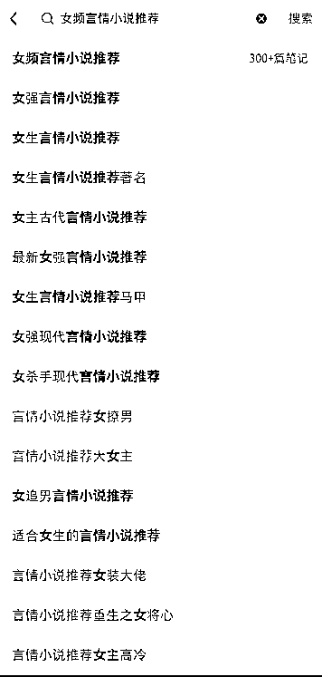

# 4.2.4 要素四：埋关键词 @云珞 YunL

思路：标题和正文用上关键词。

举例：你的定位是女频言情小说推荐。

如何找到关键词呢？有 3 种方法：

方法 1：

你在小红书搜索里输入关键词，找到下拉词，如图。

【女频言情小说推荐】是你输入的关键词，【女强言情小说推荐】、【女生言情小说推荐】等是你找到的下拉词，这些词语都可以用于标题和正文：

方法 2：

你输入的关键词是【小说】，综合、最热、最新下面这一排的关键词，如巨好看的小说、n 刷小说等关键词，都可以用于标题和正文：

方法 3：

点开一篇高赞笔记，看看它的标题和正文，测试它哪些词是关键词：

以这篇笔记为例，我推测【真的好绝】、【超级喜欢】、【甜文】、【双向奔赴】、【可冲】等词为这篇笔记的关键词。

如何使用关键词呢？

1）先把你自己为什么推荐这篇小说的理由写出来。

2）再把你收集的关键词，放到你写的内容适合的位置。

举例：我选了一本《 XX（书名）》言情小说作为我推荐的小说。这本小说我看过，我非常喜欢，怎么写标题和正文呢？

我会这样写——

第一稿：

标题：推荐一本女主言情争霸小说！！！正文：今天看了一本很好看的言情小说。已经完结了。这本书主要讲了女主穿越到异世界，带着金手指大杀四方。女主本身非常有魅力，不止是金手指的作用。以前看过类似的小说，女主拿到了金手指，却偏向于宅斗、宫斗，或者是辅助男主成为天下霸主。但是，这本小说完全不一样，女主没有被古代同化，自己拿着金手指争霸天下，为百姓带去幸福的生活。而且一点也不违和，非常符合常理。男主男配们非常有魅力，感情戏也非常好看。

第二稿：

标题：N 刷！！巨好看的言情小说，绝对不能错过（注意：小红书笔记最多 20 字，16—18 字为佳）正文：今天看了一本巨好看巨上头的言情小说。已经完结了，真的好绝，我超级喜欢。这本书主要讲了女主穿越到异世界，带着金手指大杀四方。女主本身非常有魅力，不止是金手指的作用。以前看过类似的小说，女主拿到了金手指，却偏向于宅斗、宫斗，或者是辅助男主成为天下霸主。但是，这本小说完全不一样，女主没有被古代同化，自己拿着金手指争霸天下，为百姓带去幸福的生活。而且一点也不违和，非常符合常理。男主男配们非常有魅力，感情戏也非常好看。可冲！

你留意到第一稿和第二稿的区别了吗？

我把「n 刷、真的好绝、超级喜欢、可冲」等关键词放入了标题和正文。

靠着这个方法，我经历过一篇笔记 1 小时 100 赞，24 小时千赞。

如果一篇笔记能 1 小时 100 赞，那么，24 小时后，这篇笔记能千赞。

当然，这个方法不是百试百灵的，也要看你推荐的小说是否符合自己的定位，是否符合读者的口味。

有时候，我的笔记是几天后到了千赞。有时候笔记只有几百赞。但是，这个方法让你点赞的概率更多。

比如说，你发了 100 个笔记，用这个方法，千赞笔记占 20%，几百赞笔记占 50%，几十个赞笔记占 30%（这个概率不准确，是我根据自己的笔记粗略计算出来的，但如果你做过小红书，就知道这个方法效率很高）。

为什么用上关键词法就可以让笔记如虎添翼呢？

你看我写的案例，内容非常简单，就是把小说的亮点突出来了。

有时候我偷懒，写了一篇笔记，直接取个标题，正文写了“已完结、超级好看”就发出去了，但依旧有几十赞、几百赞。

为什么我发了这样简单的笔记，依旧有点赞呢？

因为我推荐的小说好看，推荐的小说本身很有价值，所以读者容易点赞。

但你做学习博主就不一样了，必须提供有价值的内容 + 关键词法撬动流量，读者才会点赞。

内容来源：《手把手教你如何成为小红书小说博主》

