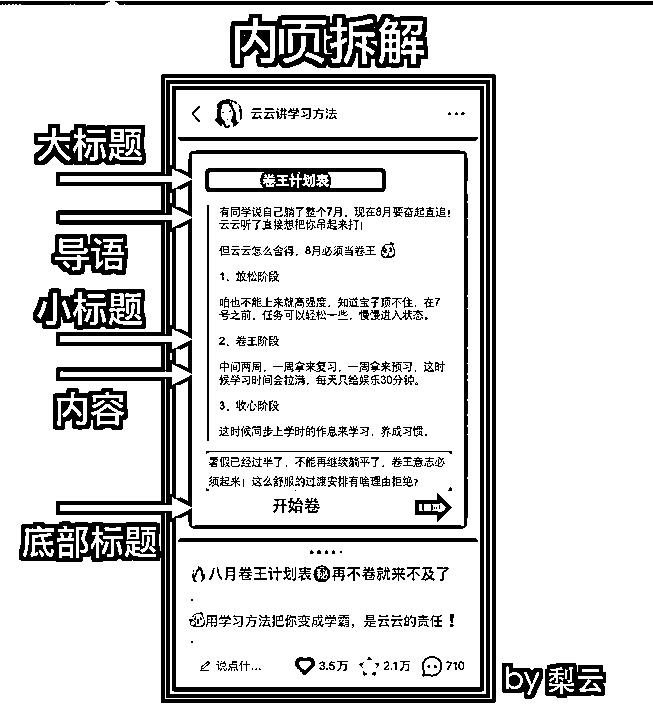

# 4.3.3 制作可批量制作内容的模板 @梨云

一个优秀的内容制作模板，不仅可以帮助我们批量生产内容，同样也能够帮助我们获取非常不错的数据。圈友 @梨云 独创了一种内容排版，并靠着这一排版形式取得了非常好的反馈，下面我们一起来学习一下吧：

排版上，跨领域参考了 1000+ 个排版，因为同行已经不能给到更多的灵感了。

接着发挥自己平面设计专业的优势，原创了一套模板，具体思路如下。

模板构成的要素无非就几个，每一个都进行迭代即可：

1）配色

选择了森系绿（因为太多人一看到这个配色排版就想起我，我立马取了梨云绿抢占心智），搭配阳光的暖黄和纯白色，给人一种温馨而岁月静好的感觉。

2）封面

选择简单粗暴的大字报排版，以两行字的形式突出标题重点，目的是为了更加聚焦关键词，让用户一目了然我这篇笔记要讲什么，从而快速做出点击选择。

3）内页

取消之前对标博主封面 + 文案排版的形式，改成全图流。

因为靠文字排版，结构感还是差了一点，容易视觉疲劳，而全图流还可以改变字体颜色、加贴纸图案，有很大的操作空间。

我采用大标题、导语、小标题、内容、底部标题的排版。

大标题：可以是对本页内容的大概括，给读者预判信息，知道这一页讲什么，也可以每一页都统一，目的是埋关键词，提高检索权重，它也是重要的广告位，写品牌名字的地方。

导语：铺垫作用，写下出这篇笔记的原因，承担一部分共鸣作用，同时也可以利用导语进行行为设计，比如我会说“宝子投稿”来暗示大家积极在评论区投稿，用留言数拉动曝光增长。

小标题：是对内容的概括，用四个字压缩一句话，减轻读者阅读负担。

内容：一般不差过 3 行，要做轻内容，提升阅读愉悦感，在行文表达时，我会用上小红书平台女生们都喜欢的爆款流行语、最近火热的梗，让内容显得灵动活泼，大家都爱看。

底部标题：这是一个非常重要的细节，也是我实践中摸索出来的，很多人模仿我，就忽略了这一点。它的作用是以游戏化口吻引导对方翻页，减少读者因为对本页不感兴趣而退出阅读。

形式是借鉴游戏中的指令性表达，句式为：开始 + 动词、马上 + 动词。

这个技巧特别好用，给人一种想要不停往下翻的冲动，只要内容没问题，阅读时长有了，赞藏评的概率也会大大提升。

这一顿操作之后，我就开始发笔记，结果第一篇，就是破千的爆款。

然后一发不可收拾，每一篇都是爆款。

为了乘胜追击这爆款来带了蝴蝶效应，我开始日更，日更了 50 天，涨到 10 万粉之后，才开始隔日更新，现在已经 17 了。

内容来源：《小红书三个月涨粉 17w，变现 10w+，我做对什么？》

