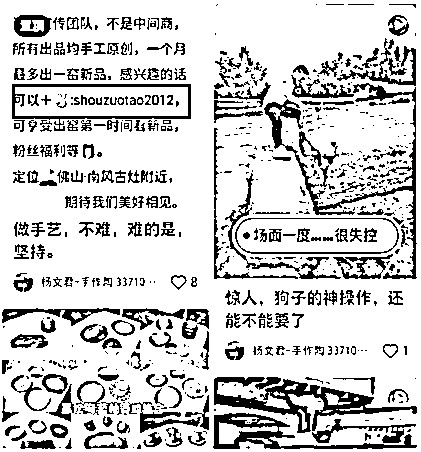

# 5.1.5 玩法五：置顶笔记 @谢无敌、@蓝子鱼

发布超过 20 条笔记后就可以进行笔记置顶了，为大家展示 3 种置顶笔记的模式：

第一种：暗戳戳的故事名片引流法。

向别人介绍你是干嘛的，有什么服务，擅长什么，但是笔记内容里不引导私信，也不留微信号，通过个人经历和人格魅力、优秀案例来吸引用户主动私信。

第二种：就属于明朗朗的放置微信号或者引流信息到置顶笔记里。

这种引流笔记，被举报的风险比较大。新号和权重低的账号，不建议采用这种玩法，很容易被举报且举报成功。

注意事项：故事名片暗示我有这个服务或产品是 ok 的，但直接放联系方式，被审核到就是明确违规。

风险：直接放微信等联系方式，风险偏高。

第三种：在置顶笔记中放置群聊信息

可以把群二维码打上马赛克，但是露出来群名字跟头像。上面文字告诉用户，有 XX 群可以加入，很多人就会在下面评论，然后就可以用上面评论区引流的方法进行引流。

还有一种情况，是引导加入小红书粉丝群，可以看下这个案例：

内容来源：《初阶 | 小红书-爆款笔记｜航海实战手册》 《新手做小红书打卡，一周涨粉 5.2 万，变现 6000+，引流私域 1500 人，简单可复制》

