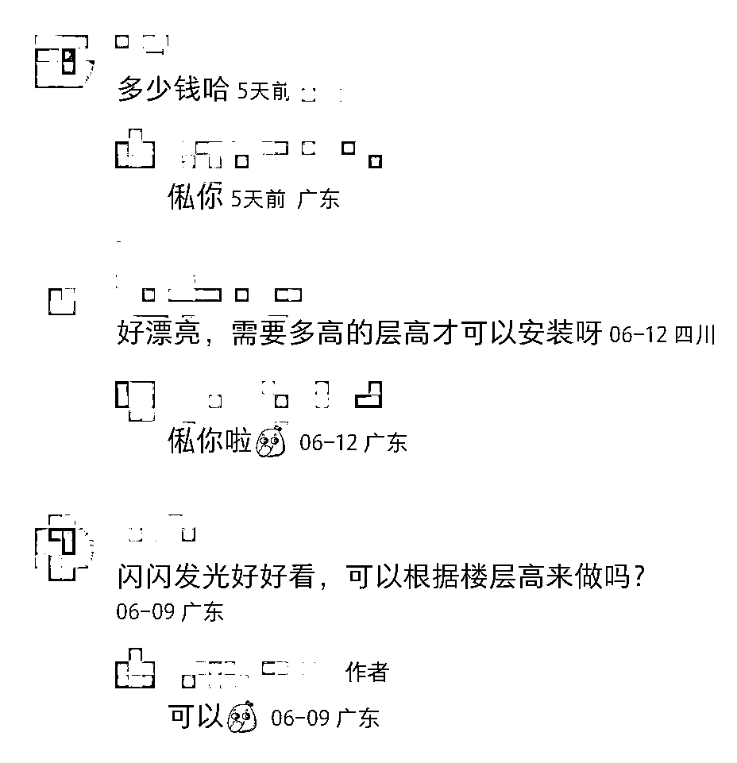

# 5.1.6 玩法六：评论区小剧场引流法和图片引流法

1）小剧场引流

博主需要多注册几个小号，或者参加一些博主之间的互助互暖活动，小号在评论区互动。

⛔️注意事项：

•不要集中安排小号评论，不然会看着很假，也会有数据异常的违规风险

•安排的评论区小剧场话术要经常有变化，不然看着特别像水军

•此方法相对来说安全～

2）评论区图片引流@Sanuk 小伞

小红书评论区可以发图片了，可以在求推荐产品的帖子下，评论图片吸引流量，比如评论区展示某个产品图，然后水军评论一波蹲链接。

内容来源：《初阶 | 小红书-爆款笔记｜航海实战手册》[《#风向标# 小红书评论区可以发图片了》](https://wx.zsxq.com/dweb2/index/topic_detail/214221225154211)

