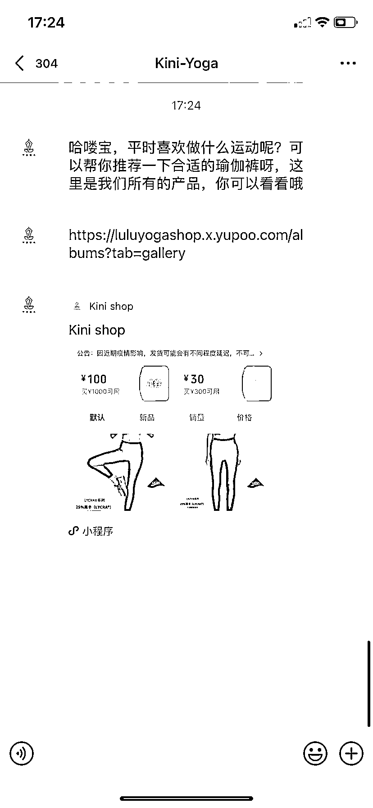

# 7.3 技巧三：话术引导 @杉木

用户添加我们的微信，通过好友之后（如果流量较大建议直接设置为加我好友时无需验证，否则容易显示添加好友频繁），欢迎语要固定下来，建议以问题开头，因为问句可以有效破冰，从而很自然地引出你要推荐的产品。

此外，提问还有个好处就是：先提问，战略制高点，变被动为主动，后面是顾客跟着你来走。

当然了，营销的学问很多，不要太过于迷恋某个话术技巧，因为我们面对的不只有一个人，而每个人的情况都不一样，灵活应对就好。营销技巧都抵不过真诚二字。

内容来源：《我是如何通过小红书，两个月带货营收 30 万＋》

