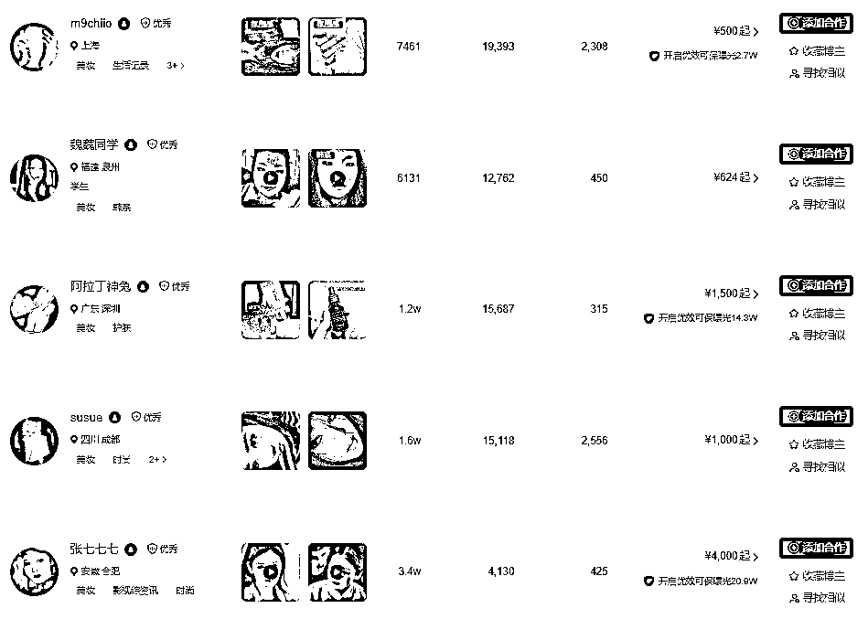

# 8.1.1.1 赛道简介

1）从小红书平台来看

从小红书平台来看，消费者画像本就以女性群体为主，主打懂生活，爱分享。

而从女性这个消费者画像来说，赛道分级如下：

•主赛道：护肤/美妆/母婴/零食/穿搭

•次赛道：科技数码/游戏/出行

2）从平台的流量构成来看

从平台的流量构成来看，小红书流量分布并不复杂，主要集中在关注页、发现页、搜索页三个板块。

① 关注页——流量占比 10%

小红书最左侧就是关注的页面，只要用户关注了你的笔记就会通过这个页面直接浏览到你的笔记。流量占比最低，且不影响流量层级的数据结果，所以有用但不多。

② 搜索页——流量占比 10%-20%

流量增长最快的的板块，有非常高占比的用户打开小红书直接进行搜索，把小红书当成搜索引擎用。虽然搜索页的流量数据并不能影响笔记的流量层级测试，但搜索页的流量非常长尾，只要关键词配置得当，可以在非常长的周期获得最精准的搜索流量。

这里要特别注意，影响搜索机制的两大核心就是关键词和权重。

【关键词】分为主关键词、细分关键词、品牌词、产品词、需求词、场景词、行业词、人群词、地域词 9 项。

以美妆类目下细分赛道——防晒霜举例：

①主关键词：防晒霜

②细分关键词：宝宝防晒霜、油性肌肤防晒霜

③品牌词：具体品牌名

④产品词：品牌+主关键词/品牌+细分关键词

⑤需求词：怎么选、怎么挑、测评、推荐、效果、怎么样

⑥场景词：户外防晒、日常防晒、海边防晒

⑦行业词：美妆护肤

⑧人群词：学生党、办公党、男性防晒、婴儿防晒、孕妈防晒

⑨地域词：三亚防晒

【权重】包括发布笔记账号的权重、评论点赞用户的账号权重，简单说权重越高排名越高。

③ 发现页——流量占比 70%-80%

发现页是笔记的主要流量来源，也是流量层级测试的主阵地，一篇笔记能获得多大量级的曝光，就看笔记在发现页的用户反馈测试了。

【分发机制】——即内容标签匹配

什么是内容标签？一篇笔记发布以后，会被系统拆分成 N 个标签，然后去推送给最近有同样内容喜好的用户。

内容侧，一篇笔记不管是图片还是文案，会被系统按照标签去区别和理解；用户侧，用户最近的阅读喜欢也是会被系统按照标签进行分类和匹配；本质上，是一种内容标签对用户标签的匹配。

笔记推送给用户后，根据用户的一系列交互行为，给笔记打上内部分数，以决定是否要继续推给其他更多用户。

粉丝的交互行为间接反映了笔记的内容质量，即便是粉丝数不多的达人，在得分优质的前提下，笔记也会被系统推荐给更多粉丝，形成“阶梯式”算法推荐

得分高的笔记，还会进一步得到来自小红书站内搜索，以及百度搜索等流量的加持，这类流量的持续性很强，笔记具有很强的长尾效应，可实现发了几年都还能保持点赞以及评论的增长。

3）从变现来看

① 平台变现情况

千粉报价基本是 500-1500 之间，万粉在 1000-10000 之间（小红书博主报价其实跟粉丝量级的关系并不大，主要还是以内容流量为主，流量好的账号报价更高）。

② 个人经验

虽然很多人可能会觉得这个赛道（护肤/美妆）内卷的厉害，头部大 v 特别多，是厮杀惨重的“红海”赛道，但是我想说的是，我们要做的事，一定要离钱近。

举个例子，我更开始做 ip 的时候，做个一个纯手绘账号，虽然起号特别快，但是面临的问题也很艰巨，就是变现难。单从接广告变现这个层面来说，要么就是文具领域的品牌本就不多，且爱白嫖（置换），做到 3 万粉丝的时候，变现最大的成就是置换了 1 个手写板，市场价 1500 左右。果断放弃。但是护肤/美妆类账号，做到 5k 粉丝的时候，已经可以接广告，如果我勤快一些，月入上万都是可以的。