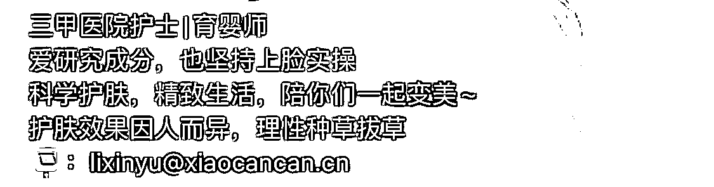
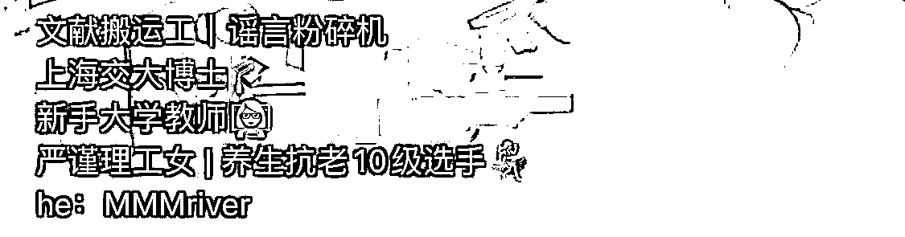
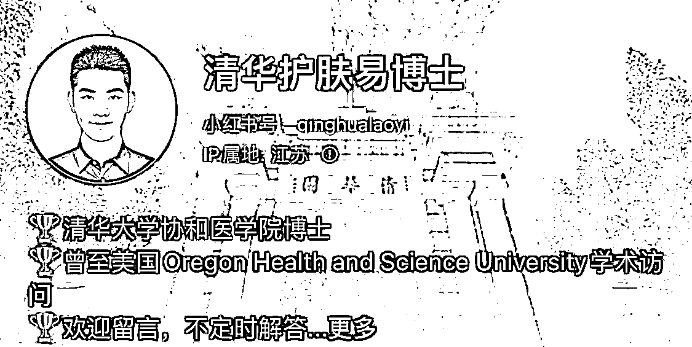
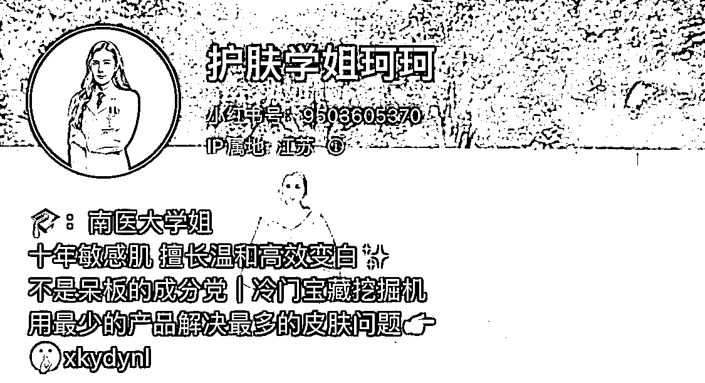

# 1）专家型内容

•硬性要求：在某一个领域里有一定知识积累，很高的学习能力，筛选辨别信息真伪的能力•软性要求：很好的抗压性（流量从来都是双刃剑，当你输出的某个观点被抨击的时候，如何正向应对）•优点：流量很大，涨粉较快•缺点：不好持续更新，对于专业度要求较高•变现方式：接广告（报备为主），专家型账号由于内容输出过于专业，更容易引发敏感词

下面是实操方法——

•名称：

常规取名套路：带有领域关键词（从搜索流量机制来说，更容易搜索位前置）。例如：xx 教护肤，护肤学长（学姐）xxx，xx 硬核护肤，xx 理性护肤，爱护肤的 xxx 或 xxx 爱护肤，护肤狂人 xxx，xx 的护肤日常

取名思路：

学历：医学生 xxx，xx 博士，化学系 xxx，清华护肤学长 xxx

头衔/职业：配方师 xxx，xxx 护肤品研发，xx 医生，皮肤管理 xx 老师，

•简介：

模版：学历/头衔介绍+个人特色（一句关注你的理由）+联系方式（邮箱）

简介案例参考：

•头像：

可以体现专业度的真人头像

•背景图：

可以辅佐真实性的图（比如：学院图，实验室的图···）

头像+背景图案例参考：

