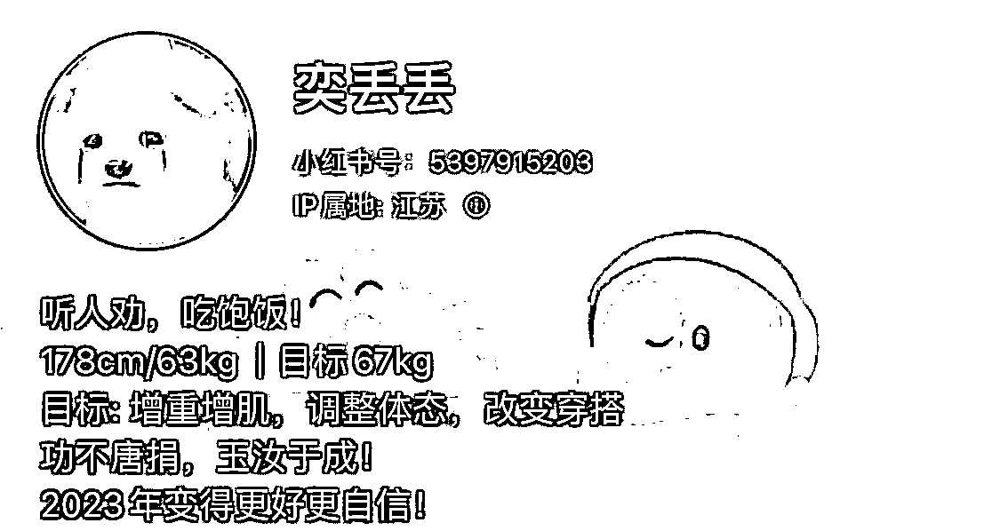
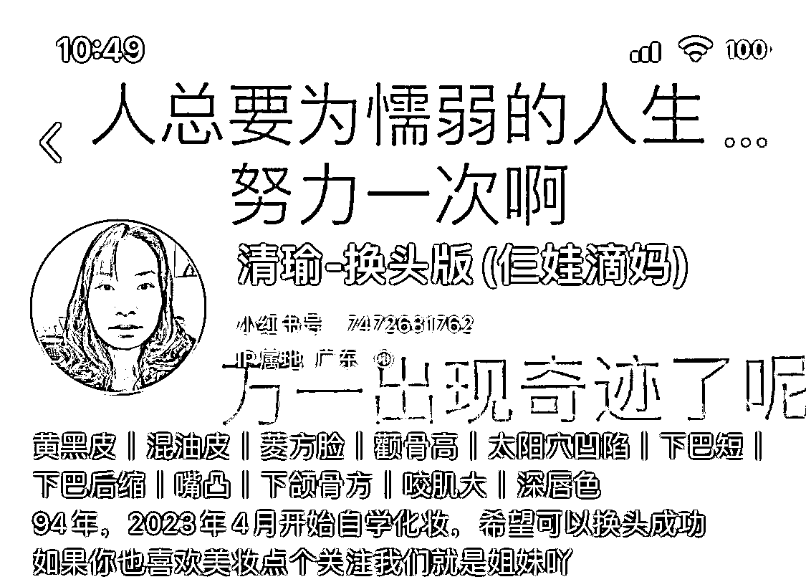
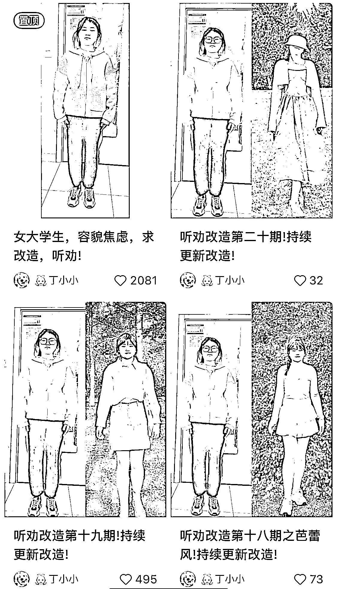
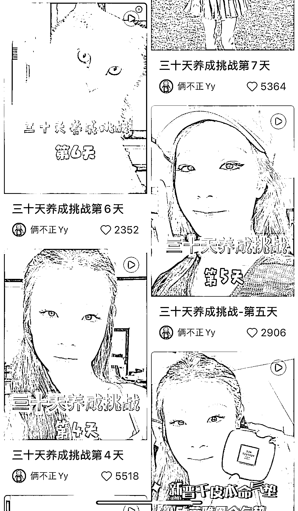

# 2）成长型内容

•硬性要求：愿意展现真实自我•软性要求：很好的抗压性（流量从来都是双刃剑，当你输出的某个观点被抨击的时候，如何正向应对）•优点：适合所有人做，尤其是寻求改变，觉得自己不够“完美”的人•缺点：需要直面自己的不足•变现方式：接广告（软植入为主）

下面是实操方法——

打造成长型账号的所有标签都要围绕个人特色展开！！

•名称：

常规取名套路：更需要突出你的个人特色

取名思路：

身份标签：xx 同学，时尚奶奶 xxx，贫穷学生 xxx

赛道标签：xx 要减肥，xx 改造日记，xx 变形记，xx 在行动，xx 在线听劝，xxx 听劝版，xx 要换头

特色标签：方圆脸 xxx，干敏皮 xxx，

•简介：

我是谁，我的目标，我已经做了什么，拿到了什么结果

•头像：

真人头像 / 和自己有点像的卡通头像 / 能体现自己心情的表情包头像

•背景图：

体现个人特色的图片 / 听劝或励志型文案

•笔记类型：

封面：before after 的对比图 +文字：改造第 n 天

笔记标题：xx+养成/挑战+第几天+变化情况

•话题：

#听劝改造 #小艾同学 #素人改造

