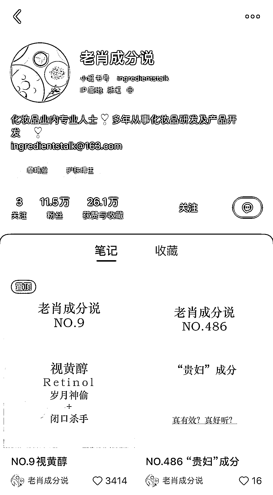

# 8.1.2.3 实操方法

这个赛道其实男女不限生，因为做的好的男性博主也有很多，尤其是头部，比如骆王宇、精致大姨夫等都是男性。

这个赛道没什么门槛，如果说非要门槛，那就是不断学习护肤知识与坚持下去。

在最开始做的时候不想投入资金也可以，只做护肤科普就行了，如下图就是其中一种方式。当不知道怎么做的时候就多看看同领域的其他人是怎么做的，同行是最好的老师。

至于投入时间，每天建议不低于两个小时，不然进步太慢了，时间主要用在表达能力、写作能力、护肤专业知识能力的提升等方面。

表达能力和写作能力这两项，就是多看+多练，真的要多看+多练！多看指的是多多看对标博主，多练是自己多上手操作，不要站在岸上学游泳。

护肤专业知识就是去搜一搜护肤书籍和各个公众号内容等（知乎、微博也可以辅助），都看一看，除了看看有没有自己不明白的知识点，还可以看看人家是怎么表达写出来的。

做此赛道有什么操作方法？

1）有一个小红书账号

在小红书做内容博主，只需要一部手机，一个手机号就可以，用新号或者以前的老号都可以，没必要非要换新手机号去做，这些都是没必要的纠结，只要账号没有被限制就行。

2）装扮账号

我们从以下几个角度去操作，它们都是对账号的加分项：

① 账号昵称：最好是和护肤相关的，或者可以亮明专业背书的，比如：化学生…、医学硕士…、爱护肤的…、配方师…

② 简介：简介的内容主要给大家一个关注你的理由，可以介绍自己研究护肤多少年、解决了多少皮肤问题、专业背景，或和本赛道相关的兴趣爱好，总之是为了让人信任认可。

在最后一行附上自己的邮箱，方便品牌方的合作邀请。

③ 头像：头像要清晰，最好能突出自己的专业性，这是很好的加分项

④ 背景图：可以是用来辅助简介的照片

具体可以参考以下博主：

