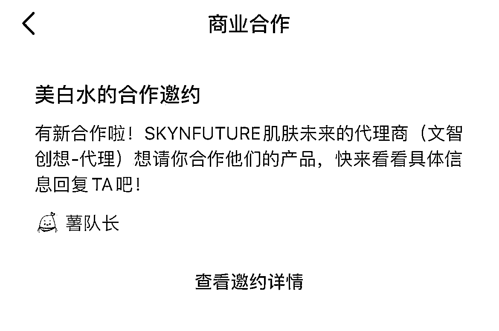
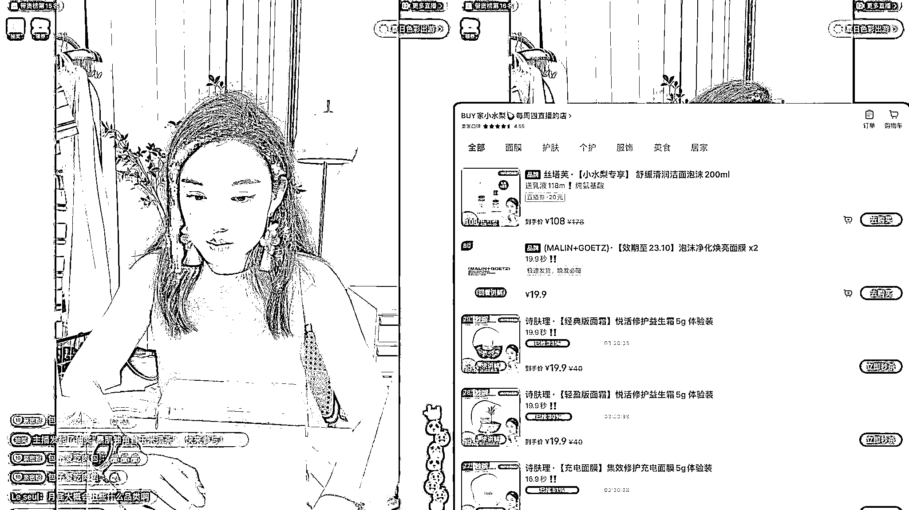

# 8.1.2.4 变现方式

1）接广告

这个是最常见的变现方式，也是相对简单的一种变现方式。

就是品牌方过来找你进行护肤品的合作，①如果粉丝少的话，可能没有稿费，只赠送产品；如果粉丝有大几千，品牌方不仅赠送产品，还会给稿费，稿费一般是粉丝量的 1/10，比如粉丝是 10000，稿费则是 10000*1/10=1000，不过这个是一般情况，有些账号做得好是要比这个报价要高的。

接广告的收入变现天花板挺高的，一年几万几十万几百万都可以。

合作方式主要通过小红书平台邀约，也可以通过邮箱接受合作，这些都需要加到微信上详细聊细节，加上微信后以后也可以重复合作。

2）引流到私域卖护肤相关的产品

就是把粉丝加到微信，向粉丝售卖产品获取利润，普通私域卖货的利润一般是 30-50%，如果是自己旗下的产品，利润会更大。

3）直播带货

就是在小红书上进行直播卖货，根据售卖数量获取相应佣金，大博主还会有坑位费，这个变现方式对粉粘性的要求比较高。

