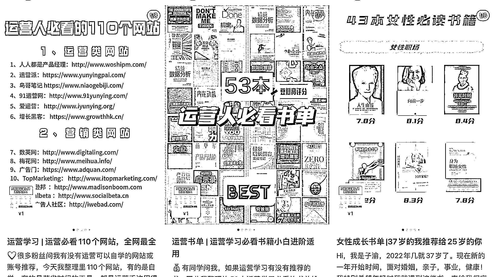

# 8.3.1.3 经验总结

我做职场赛道这段时间，基于我爆过的笔记，我简单总结一些可能对大家有帮助的点，更适合限职场成长赛道参考～

1）起号阶段可以少量做信息整理类的笔记

比如书单、网站、app 等各种清单，尽量做得比别人齐全或推荐别人不知道的内容。建议直接做图文，比视频省事，图文时间基本就是花在整理上。前期设计首图也费了一些时间。

这种很适合留钩子引流。

2）尽量结合自身经验来做干货分享，不要干巴巴科普，教科书一样

每个视频，每个图文都从自己的经历或者身边的经历切入，尤其是从从小白走到老鸟的亲身经验，会显得更加真实、接地气，用户不会有被老师教学的感觉。

我测试下来，小红书用户确实更喜欢故事经历案例类型的笔记，爆的概率也更高～

•比如 XXX 同学用我教的方法成功找到月薪 3 万的运营工作

•比如互联网大厂运营工作 10 年，分享我的职场 XXX 或求职 XXX 经验。

这种也很适合留钩子，会吸引到精准咨询。

3）聊钱相关的话题，任何一个类目都可以谈到钱。

比如运营薪资大揭秘，升职加薪的秘诀；比如省去一万钱的免费课程大合集，亲测好用的 10 个低价 XX 产品；诸如此类～

我目前账号写这个话题的内容还不多，后面打算做一个系列来分享薪资、内幕

除了选题，怎么保持内容输出不断更应该也是职场博主共同的痛点吧。

不断更既考验心态，也没有太多捷径，但可以通过各种小方法提升输出效率。