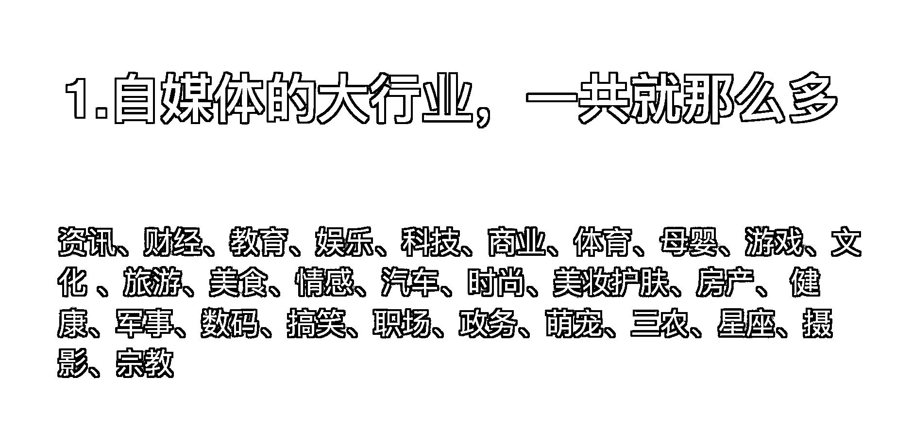

# 8.3.2.1 为什么选择做职场号

标红 = 离钱近

我在选择小红书创作方向时根据自己的经验找了一圈，发现离钱近的方向里面，最适合自己的就是职场方向，原因有两点：

1）我担任过业务面试官；

2）曾半年跳槽四家公司，亲身经历并通过了大小规模企业的面试流程；

如花爷所说，做 IP 的关键是找到自己的 “势能差”，这个世界永远是 90 分的人教 80 分的人，80 分的人教 70 分的人，70 分的人去教不及格的人。因此专业有专业的做法，小白有小白的做法。

我的职场经历对比大厂 HR 而言不值一提，但对帮助初入职场的大学生来说足矣，在我给真实客户做咨询时会发现，大部份对求职心存恐惧的人，面试经历都不超过 3 次，就好像初恋时分手哭的死去活来，等多分几次自然就好了。

基于这一点观察，我的笔记除了写求职技巧的干货外，也会将求职时的情绪问题作为选题方向（如下图），这类笔记很容易引发读者共鸣进而评论，带动笔记数据进一步提升：

