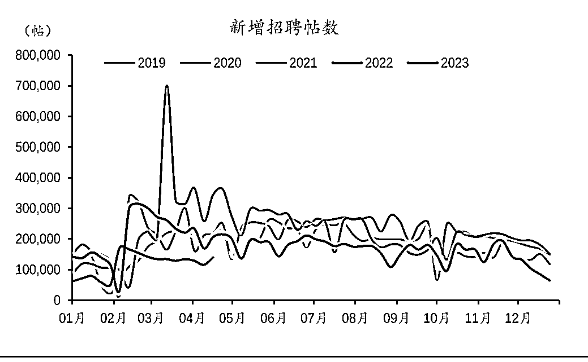
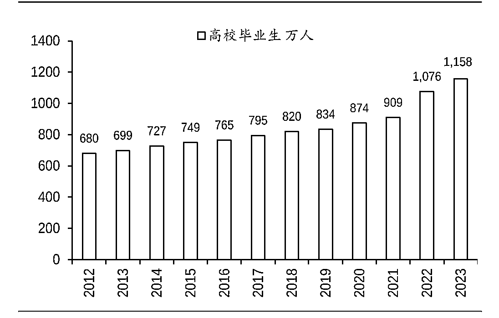
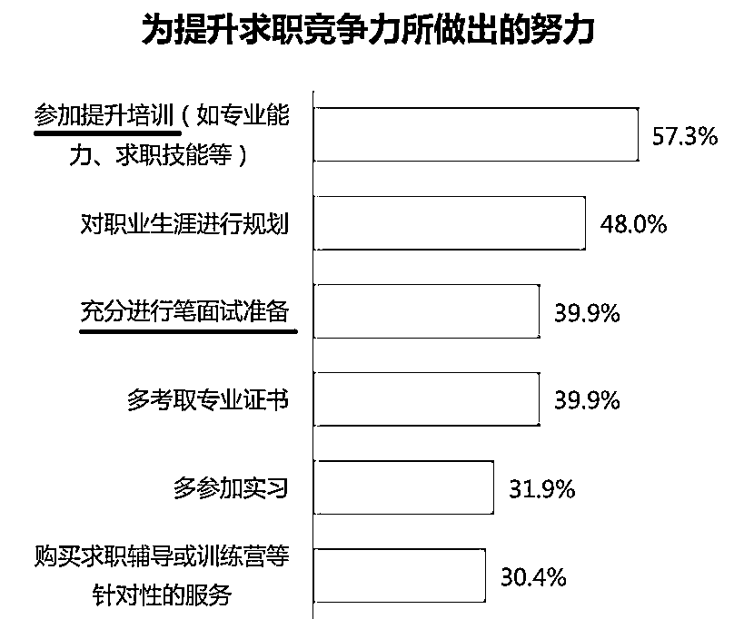

# 8.3.3.4 变现前景

看完上面的内容，你是否会觉得职场号好像没什么 “钱途”，不太适合作为纯博主的变现方向？

其实职场号很适合做个人 IP，前期的变现能力可能不像美妆、家居、母婴类博主那么强，但只要能长期经营下来，变现方式还是很多的，详细可参考上方 @子渝 的职场号案例分享贴。

数据来源：国泰君安行业景气度观察系列报告

数据来源：教育部

其次，近两年较为严峻的就业环境也为做职场类帐号提供一定利好，今年应届毕业人数创历史新高，同时面对宏观经济环境下行，多数企业选择减缓人员招聘甚至有所缩减，对于应届生群体的就业压力非常大，因此学生群体会更愿意参与求职与专业技能的培训，以扩大自己的竞争优势。

