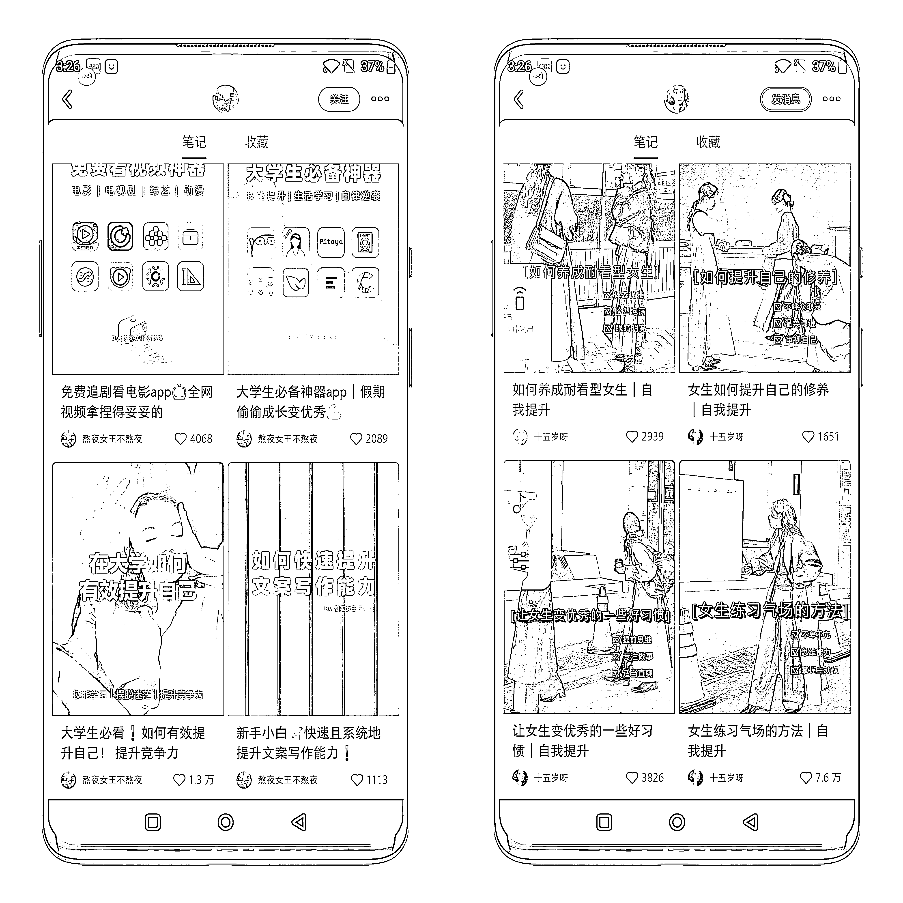
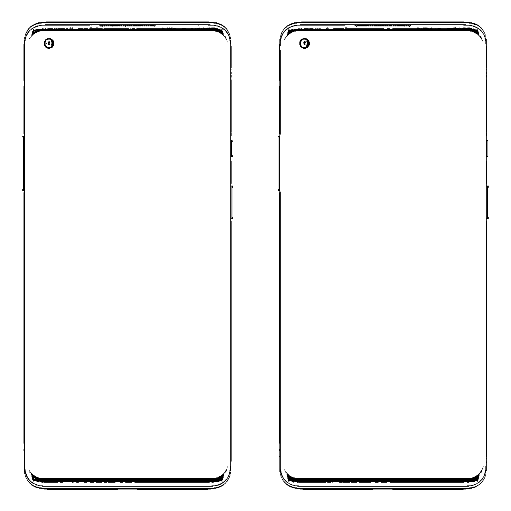

# 8.4.2 实操流程

1）注册账号

•头像、昵称一次性设置好。（设置为女性相关，比如什么七七、小鱼爱分享...，头像尽量选择一些美女头像，女生看着也会舒服一点。)

•选好推荐领域：读书、教育、摄影、明星等（需要跟目标用户群体相关，这样的话平台会对账号进行分类，平台就知道我们的账号是哪一类的了）。

•用新号，可以把之前的账号注销掉再注册，不要用以前的老号，影响很大，很可能你发布几十篇笔记都没有进展（我拿了 10 个号去测试，新老各 5 个，新号会比老号的数据起步快）。

•一机一号，如果不用手机号注册可能会出现后期发不了笔记的情况。

2）养号方式

为什么要养号？我试过不养号然后去发笔记，数据起来的很慢，周期很长。如果是这样，不如前期拿出几天来去养一养。

每个账号养 3-5 天，每天利用碎片化时间（七七八八加起来一个小时）去刷同行的内容（做什么类型的账号就刷什么类型的笔记）

养号是整个流程最重要的，我试过不养号去发笔记，周期很长，基本上要一个月内阅读才会有所突破。

在养号过程中关注一下小红书官方平台的账号：创作者小助手、小红书成长助手、美妆薯、校园薯等。

3）内容来源

短视频渠道：抖音、快手

论坛渠道：知乎、百度、微博

图文渠道：小红书、头条号、百家号

我最常用的就是小红书、知乎，养好账号后给推送的内容就是你可以抄的内容，抄同行的高赞内容，知乎跟小红书的内容差不多，内容也都是大家互相抄。

譬如在首页刷到"女生如何变得更优秀"、"女生如何变得大方且有气质？"、...这类高赞内容。

我们做的成长类账号主要是女性的成长类，因为小红书这个平台里面的用户大多数都是女孩子，而且都是想要变好的女孩子，变美，有气质，读书，做菜等等等。

再结合后期变现难易度的问题，我对比了壁纸类，音乐剪辑类，本地旅游等行业，发现成长类的变现是长期且可指数级增长的，并且账号内容还比较容易做，最终就选择了成长类。

4）如何选择封面、底图

微博搜：壁纸

网站搜：壁纸

可以选择一些纯色壁纸（不要太亮的颜色），美女壁纸也可以，很多同行也有用。

选择壁纸也很关键，好看的壁纸能留住更多看你笔记的人，给你点赞。

这里给大家找了一个同行做的很好、很精细的账号，大家可以看下：熬夜女王不熬夜。

这个账号做的十分精细，很多细节处理的也很好，给大家举例这个账号的原因是，她做的很精细，封面、底图也选择的很好，大家可以通过这个账号找一点灵感，从而去找合适的封面跟底图。

tips：一般找到的壁纸都不符合小红书的比例，先裁剪成 3:4 的比例再作图，刚好适应小红书的比例，不然会被裁剪一些。

5）作图软件

美图秀秀：可以用来拼图、制作图片。

黄油相机（我最常用的软件）

找到一篇高赞笔记，保存到相册。发给自己的微信小号-长按图片-提取文字-打开黄油相机-加字-复制-修改字体-保存。

创客贴（有模板可以直接套用）

给大家演示一下平时我是怎么做图的。

[8c792a5b29b2df1f01956fc3c92ee5e2.mp4](https://search01.shengcaiyoushu.com/upload/doc/JIuYdUvt9o3K00xE8MJc5clunVg/ZnuibUu3uof25DxG91McGtX3nDd)

6）内容排版

在一开始就定好排版，字体可以来回换，但不建议底图一直换。做的久了粉丝就多了，如果你的底图一天一变样，给粉丝的感觉也很乱，可能就会取关了。

7）内容发布时间

早上、中午、晚上、凌晨，没有硬性要求，是自己实测的结果，我一般都是在下午五点左右发，有两天在晚上十点左右发的，数据明显上不去。

定好一个时间发布，以后就尽量就在这个时间左右发布。

8）细分领域

女性成长、学习、心理学、人生规划、情绪、电影、书单。

目的：引起 20 多岁女性、大学生的共鸣，使用小红书平台的大部分都是女性，就是去揣摩这类群体的心理，吸引他们的眼球。也试过专门写给宝妈群体的笔记，但是效果很差，80%的宝妈希望看到的笔记都是跟孩子有关的。

9）什么样的选题才能火？

① 受众广

选题要兼顾所在领域大部人的需求，太冷门的也有爆的可能性，但是不稳定，不如选一些受众广的。

比如：女生如何提升自己的格局？、女生如何变得优秀？...

② 情感共鸣

选题直接戳到了用户痛点、困惑、关心、需要、了解...

选题观点与用户个人立场一致。

③ 无脑型

如果自己实在是有选择强迫症的话，那么就直接搬运知乎高赞回答里面的内容。

10）每天占用的时间

最开始制作一个笔记需要 20 分钟，熟练以后只需要 5 分钟。我是在前一天晚上睡觉前刷刷小红书，找一找同行高赞笔记，为明天的笔记做准备。

11）发布笔记事项

每天发布 1-2 篇笔记即可，发的太多容易被小红书平台判定为营销号。

小红书一次性可以发 9 张图片，根据内容制作图片即可，没有规定一定是 3 张、6 张、9 张，选择好图片后可在首页对内容添加标签（根据内容去加，譬如心理学，就加心理学标签...），点击下一步，根据封面填写对应的标题，我很少写正文，都是@一下小红书官方账号（养号时关注的官方账号）。一定要选"参加话题"，跟笔记的曝光有很大的影响，譬如标题是"女生如何变得优秀？"，可选择"女生"、"我是女生"的话题，选择关注人数越多的越好。

广告主私信时可直接回复微信号，怕不安全的是可以做成图片发给广告主。

账号被限流时就去养号或者放三天再发，不要蹭热点。

我的七个账号，四个账号都是连的同一个无线，目前没有任何影响。