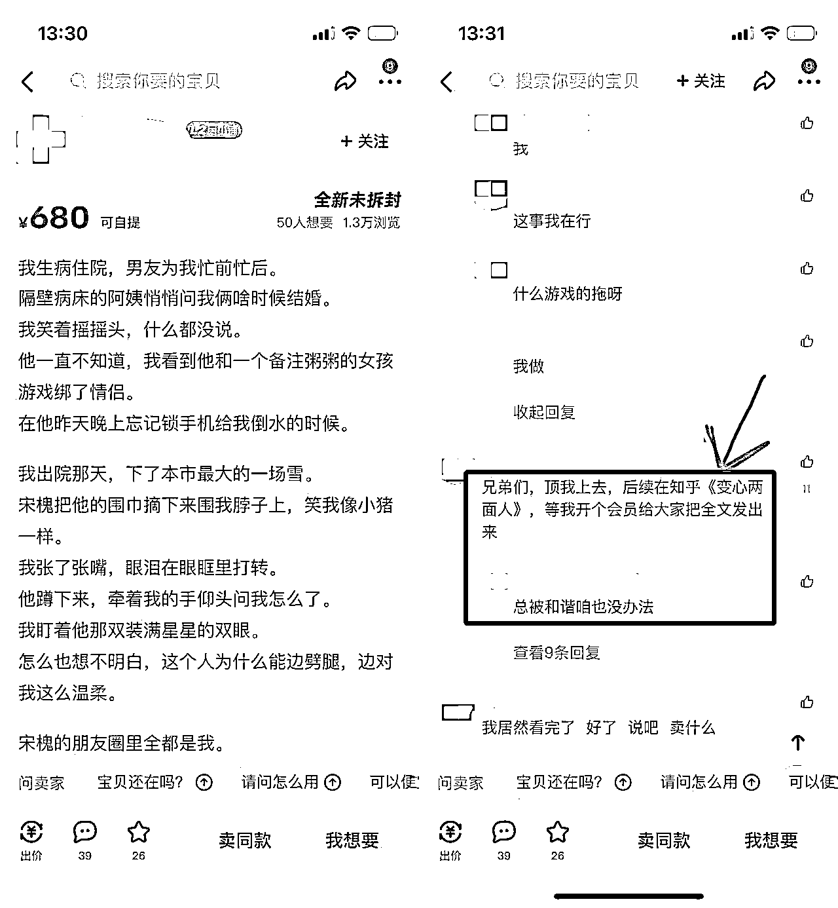

# 1.1 项目介绍@鲸鱼 @张柯 Ker

不知大家在刷短视频时有没有刷到过这类视频：

视频中可能播放着解压视频、美食视频，看起来像是营销号，可视频内又在讲故事。这就是短视频小说推广的一种玩法：小说推文视频。

小说推文，顾名思义，就是通过在各媒体平台发布小说类视频作品，引导用户去小说平台阅读小说。该项目整体来说，门槛较低，很适合新手尝试。

它不需要过硬的技术性要求，发布视频 + 引导阅读就可以产生收益。只要足够耐心，不断去优化视频，提高选文能力，积累实战经验，都能拿到成果，是一个可以长期执行的项目。

这次我们主要说小红书和抖音这两个平台，玩法上主要有视频推广和图文推广两种，在「五、创作并发布图文」和「六、创作并发布视频」两个章节里展开阐述。

如今小说推文在抖音平台已进入平稳期，但在小红书平台还属于入门阶段。目前小红书有超 2 亿月活用户，其中女性用户占了 7 成，是一片潜在的蓝海。

与此同时，入局成本低，也就意味着竞争会加大。随着版权监管越发收紧，各平台近期有大规模的封号行动，不止是推文领域，涉及到「混剪」这块的很多账号都被封禁。

封号是问题，是风险，同时也是机会。许多老号被封禁，很多人被劝退就换项目了，但流量又一直在那里，所以近期一些新号的流量反而好起来了。

这里就需要我们做好更精细化的运营，做到人无我有，人有我优。

最后希望大家不要定死在一个框架里，小说推文项目非常灵活，还有很多蓝海流量没被挖掘出来。理论上来说，只要这个地方，能打字，能发东西，就能干小说推文这件事。

像这个闲鱼，有人挂的内容就是知乎的文章，然后评论区引导关键词，这样也是可以做转化的。

部分内容来源：《知乎小说推文项目保姆级实战教程》《小说推文的玩法类型，以及我对三类玩家的建议》

