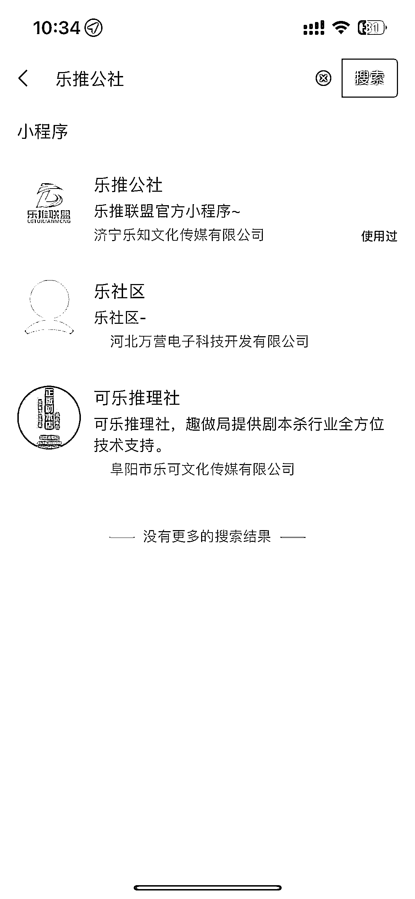
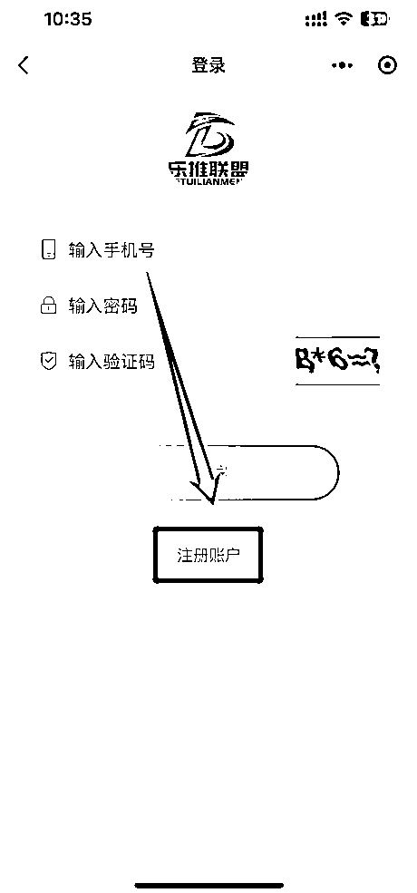
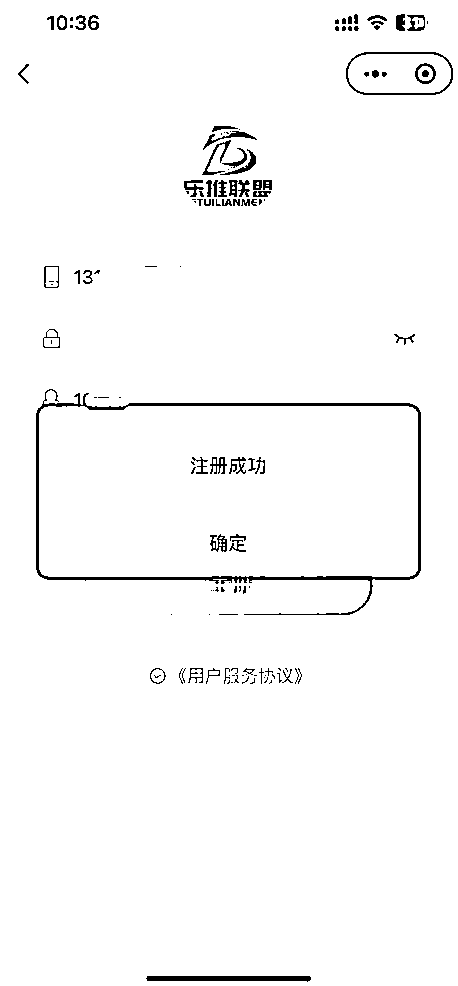

# 第一步：账号注册

【乐推公社】注册地址： 手机端：微信搜索「乐推公社」小程序 电脑端：浏览器打开网址：[`iletui.cn/system/user`](https://iletui.cn/system/user) 邀请码：10090

现在我们以手机端为例，看看整个注册流程：

微信搜索【乐推公社】进入小程序后，点击下方注册账户，输入对接人提供的邀请码，点击注册后即可注册成功。

小程序主要用来注册和查看每日数据，申请关键词或回传作品等，需要在后台操作。