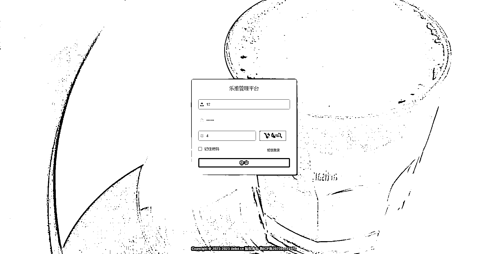
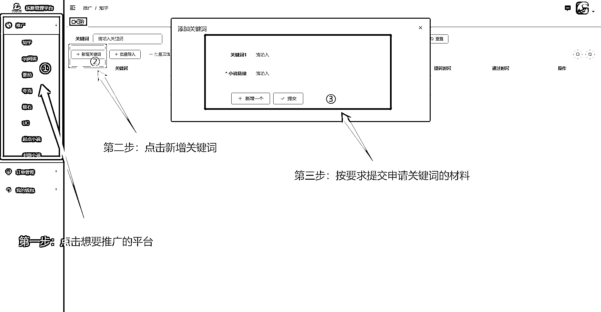
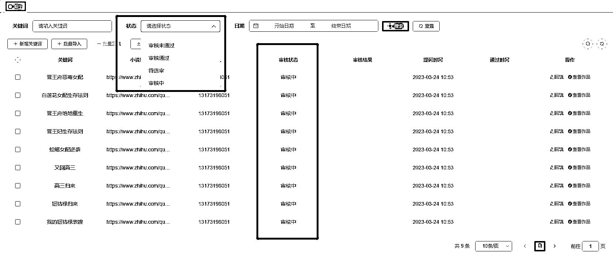
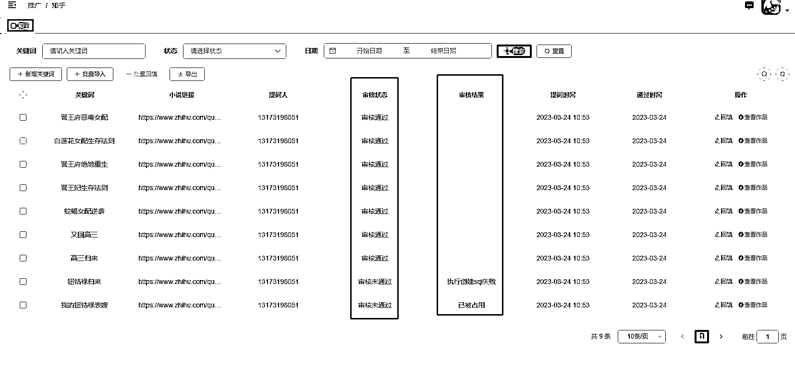
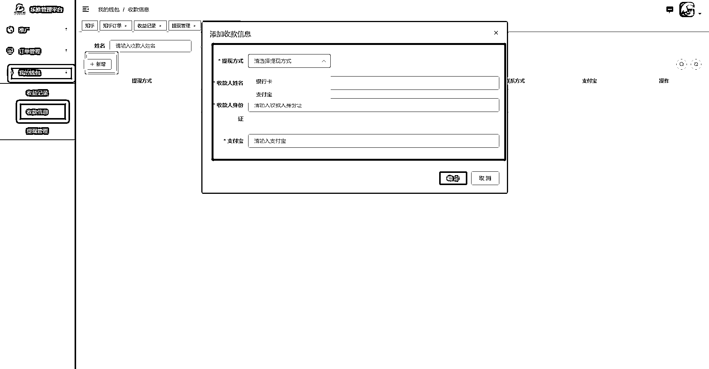
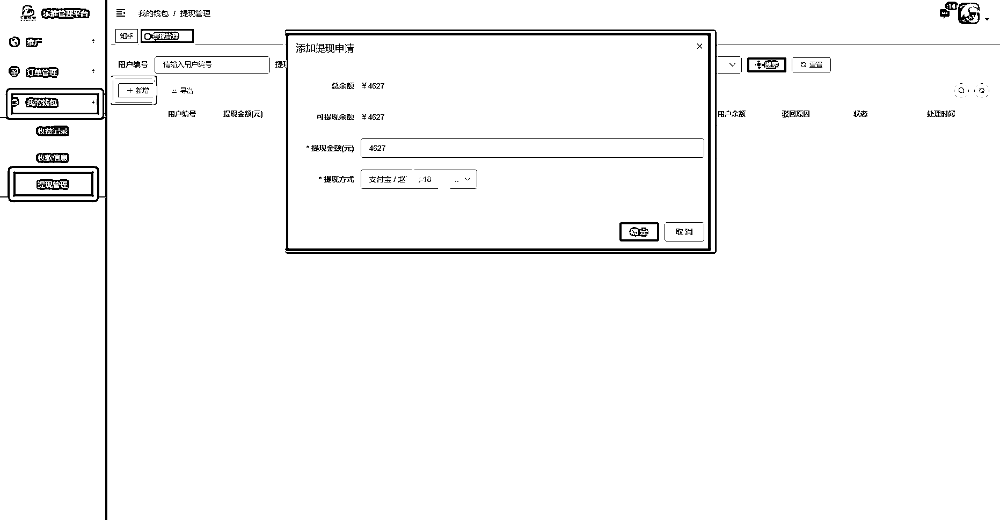

# 第二步：登录后台开始使用

后台网址为：[`iletui.cn/system/user`](https://iletui.cn/system/user)，使用刚刚在小程序注册的账号和密码登陆。

1.如何申请关键词？

主要分为三步：

关键词提交后，会实时显示关键词的状态，关键词申请结果如下图所示

2.填写回传

点击对应关键词后的“回填”选项，填写回传，如同一个关键词发布多个作品或者同个作品发布多个平台，可选择【新增一个】选项。

3.订单查询

点击：订单管理-平台订单，即可查阅该小说平台所有订单。如果订单量多，可通过上方「关键词」和「出单日期」进行查询。

4.余额提现

需要先绑定自己的支付宝或者银行卡，点击：我的钱包 - 收款信息 - 新增 - 提现方式

然后点击：我的钱包 - 提现管理 - 新增 - 输入提现金额 - 选择提现方式 - 点击确定

需要注意的是，余额提现无需手续费，但需要签订「灵活就业协议」。

这里的协议，是指由平台方（这里即乐推联盟）与劳动者签订合作协议，约定平台业务类型，由劳动者自主决定是否接受平台业务并向第三方提供服务，平台不承担社保责任。

这类协议对个人没有什么影响，可以参考在抖音上做带货赚佣金，提现时也需要通过云账户签订灵活就业协议。

这一步也不需要大家做什么准备，在提现过程中自然会引导大家进行操作。

提现后会在 1-2 个工作日内到账，节假日会不定期顺延，届时会有公告通知。