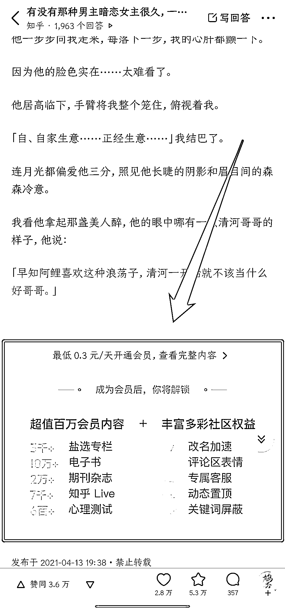
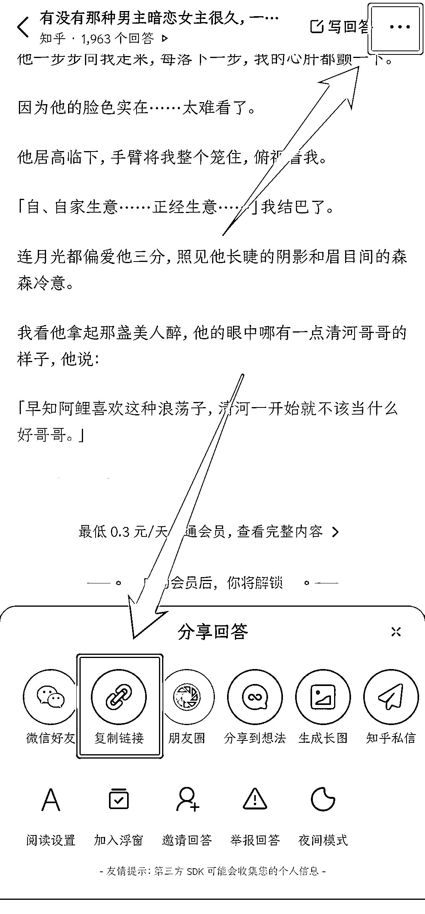
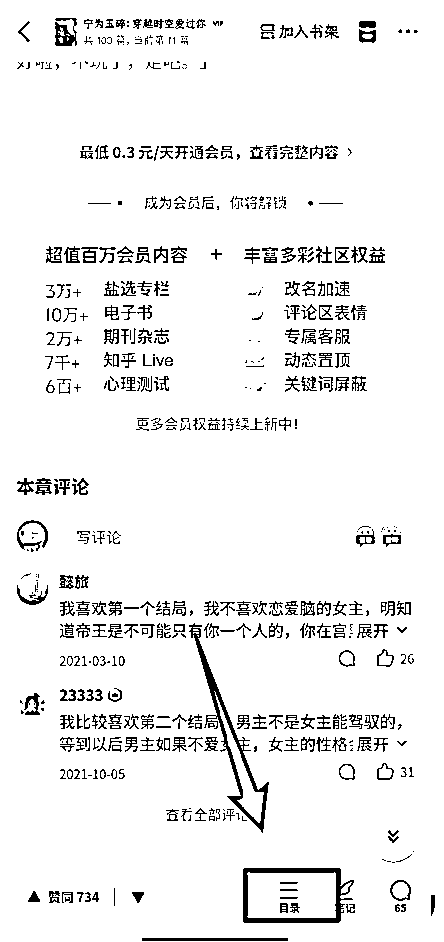
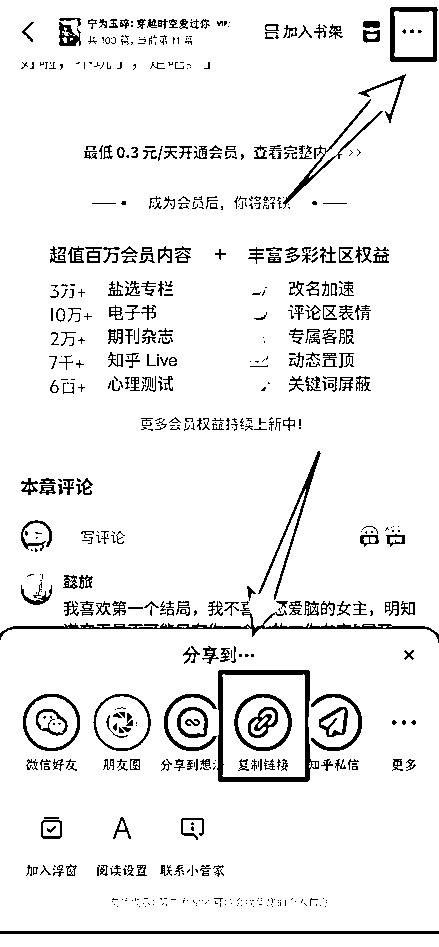

# 第一步：获取小说链接

知乎上的小说一般分为问答和专栏形式，不管其是那种形式，在复制链接前，我们都需要先确认文章是否为会员文。打开文章后，滑到文末，出现付费提示的就是会员文，可以用于推广。

问答形式内的文章，直接点击右上角三个点，复制链接。

右下角显示有「目录」的，是盐选专栏内的文章。点击右上角三个点，复制链接，把链接中的「？」及「？」之后的内容删除，就是小说链接：

如，原链接为（仅做示例用，无法点开）：

[`www.zhihu.com/xxxxxxxxtion/1573680509615603712?is_share_data=true&vp_share_title=0`](https://www.zhihu.com/xxxxxxxxtion/1573680509615603712?is_share_data=true&vp_share_title=0)

找到「？」，将「？」及其后面内容删掉即可：

[`www.zhihu.com/xxxxxxxxtion/1573680509615603712`](https://www.zhihu.com/xxxxxxxxtion/1573680509615603712)