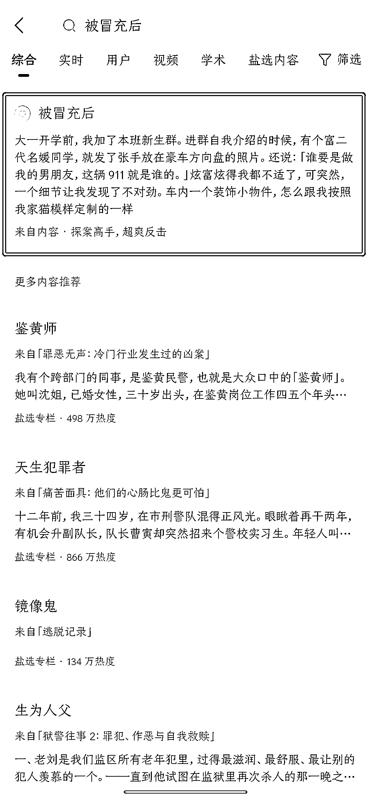
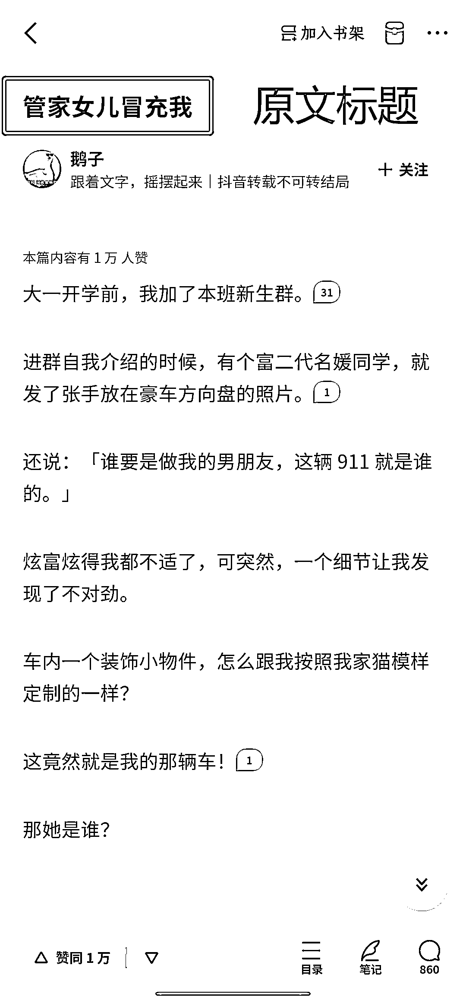

# 第二步：申请关键词并检查

请按照「2.3 平台使用流程」中的流程提交关键词信息，填写完毕并提交后，会有专人审核这个关键词是否通过审核，结果可以在后台进行查询

申请完关键词后一定要查看是否通过审核，不然可能做无用功。

•关键词要求：

1、4-10 个字

2、不能有特殊符号（标点符号）或者纯数字

3、关键词不可与原书名，章节名重复（不能直接改写原书名，章节名 ）

在申请时，可以同时申请相关关键词，如：无情公主、无情的公主。对于详细的关键词组词思路，后文中会提到，可以参考：「4.2 获取关键词」

•关键词提审时间：

周一至周日 10:00；11:00; 14:00; 15:00; 16:00（周末正常审）

•关键词审核时间：

每个审词节点 10 分钟内。

•关键词有效期：

关键词有效期 180 天，超过 180 天就不可再使用。

•关键词查重：

另外，在申请前，我们需要确认知乎上是否有人申请过了，可在知乎上搜索关键词查看结果。如果可以查询到，需要再做更换，避免重复。

如果该关键词被申请过，会直接跳出该小说页面，如下图所示：

