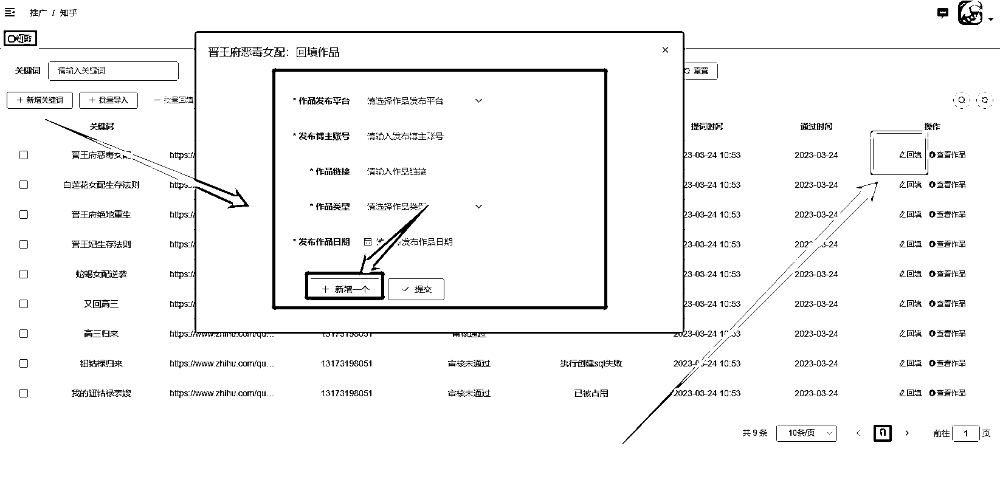

# 第四步：作品链接回填

把发布的视频链接结合关键词填写回传：

•回传链接方法：

点击对应关键词后的“回填”选项，填写回传，如同一个关键词发布多个作品或者同个作品发布多个平台，可选择【新增一个】选项。

•回传时间：次日 8:00 前提交昨日回传（发布的所有作品链接都需上传，不分平台）

发布完成作品之后，一定要及时填写回传链接，不回传作品链接的话，官方平台无法回传系统，也就无法知道订单是从哪里来的，即使出单也无法结算。这是平台为了打击反作弊做出的要求。

如果未填写链接进行回传，服务商也无法结算给你，因为官方平台没有结算给服务商。

注意：不管同一个关键词发布多少作品/多少平台，每一个作品的链接都需要回传。