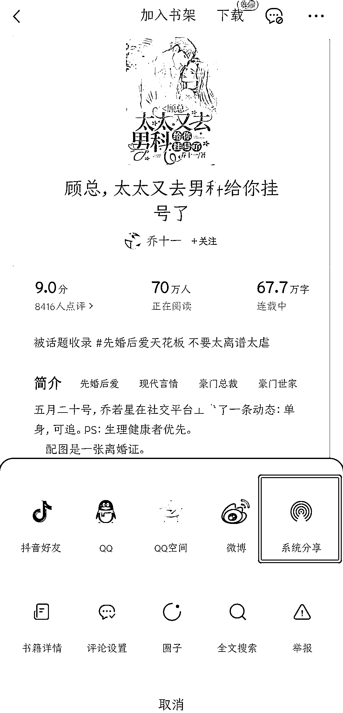
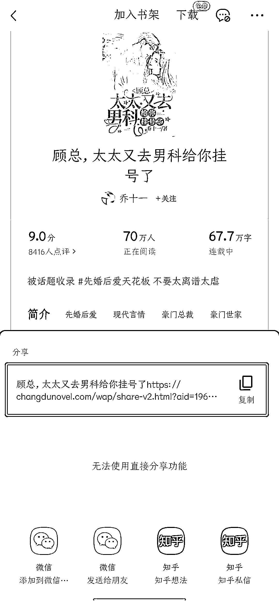
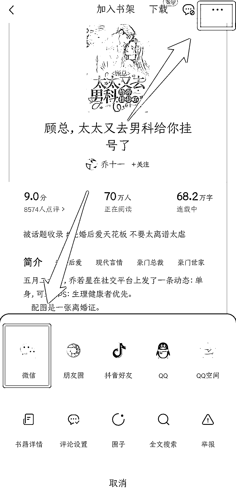
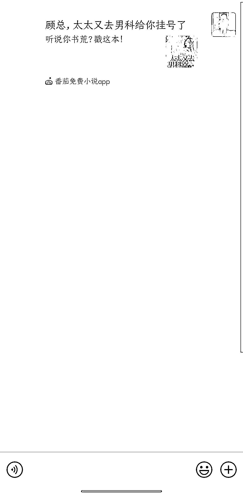
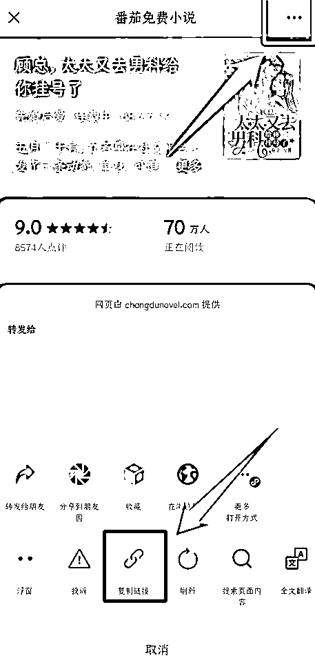
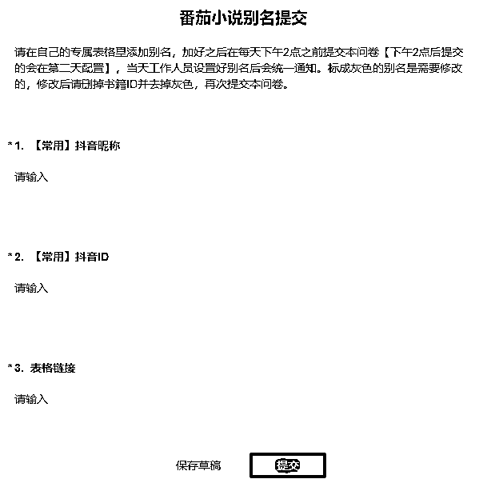
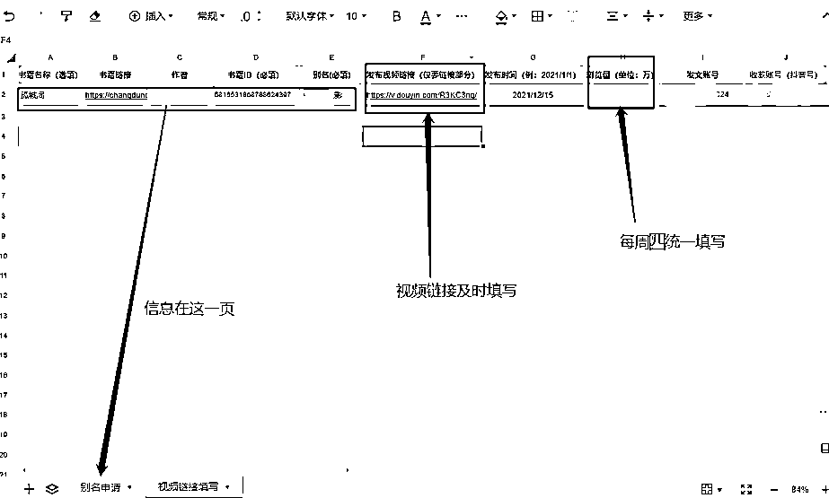

# 方法一：自己与番茄小说官方申请合作

注意：

如果选择自己与番茄小说官方对接，对接中产生的问题需要自己解决，包括关键词申请、链接回传、佣金结算等，且不可使用「乐推联盟」的合作表单，官方和服务商是两个查询系统，并不互通。

1）第一步：联系番茄小说官方客服

在工作时间给客服打电话，点击按键「0」转接到番茄小说平台，再点击按键「6」转接人工。

官方客服电话：95152 工作时间：每天 8:30-22:00

和客服说：“我想在抖音推广番茄小说，请问如何签约”。客服会提供一个微信号，在工作日添加该微信账号，备注：“达人推广+在抖音上推广番茄小说”。好友通过后，根据官方要求，进行后续签约动作。

2）获取小说链接

方法一：选择小说，点击右上角三个点，点击系统分享，复制小说链接，删除文字部分。

方法二：

选择小说，点击右上角三个点，点击微信。转发到微信后，打开分享过来的链接。点击右上角三个点，复制链接。

在方法一不适用的时候，使用此方法。

3）填写关键词申请表

当日下午 14:00 之前提交的，当天工作人员设置好别名后会统一通知。下午 14:00 后提交的，顺延到第二天配置。

标灰的别名表明未通过，修改后重新申请。若已发文建议及时更换别名，将新通过的别名放到评论区等。

4）作品回填

把发布的作品链接结合关键词填写回传。不管发布多少视频，在哪个平台发布，只需要填写一个关键词即可。

