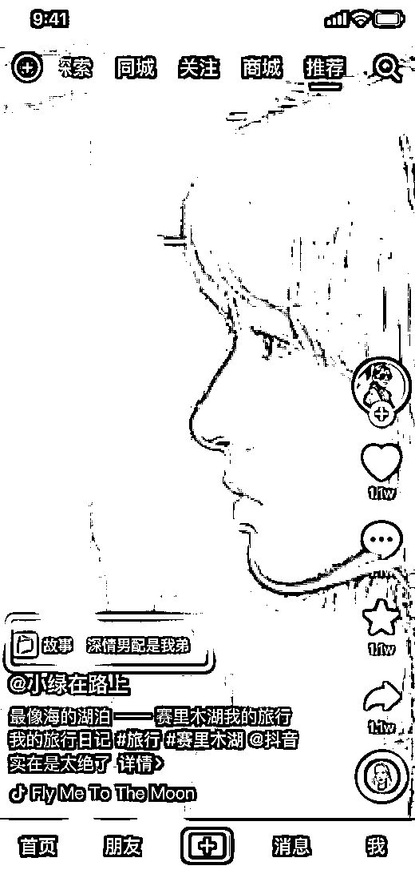
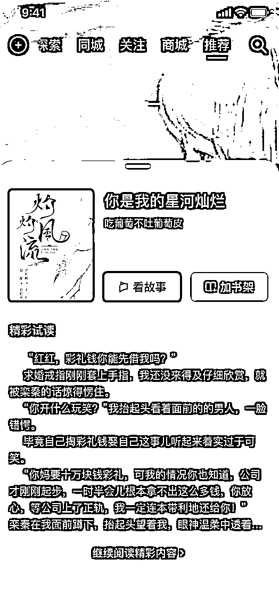
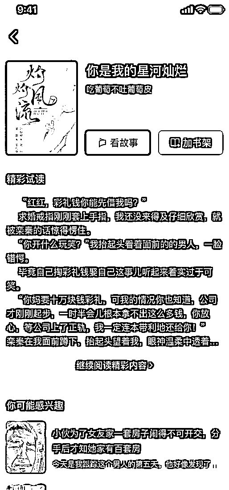
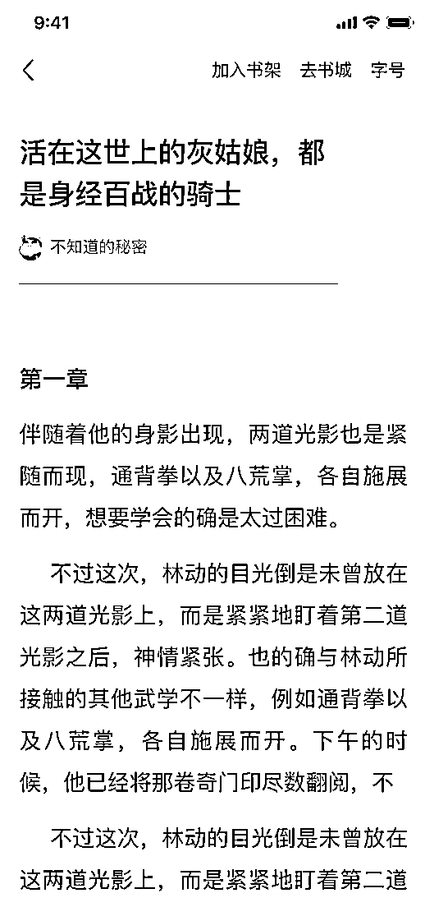
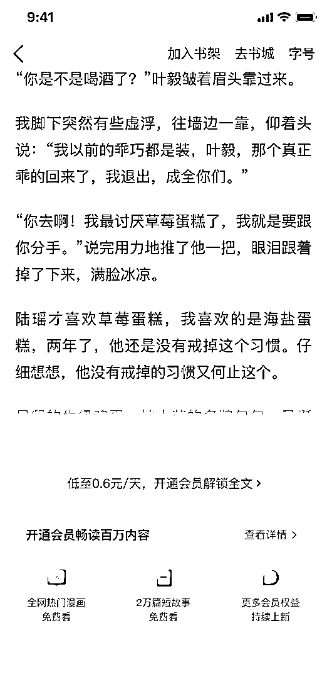

# 2.7.1 用户付费路径

先来通过一组图看看，该推广方式下用户的付费路径：

简单说明一下上图的演示：

图一：在视频页面呈现「故事」标签，引导大家点击；图二：用户点击该标签，跳出小说页面；图三：继续阅读，跳转到完整的小说详情页面；图四：继续点击阅读，跳转到小说正文内容，开始阅读；图五：限制用户继续阅读，引导付费阅读。

这么一梳理，我们不难发现，其变现路径与前几种推广方式大同小异，都是通过引导到小说页面，再引导开通会员完成用户付费。

所以我们要做的，就是在视频中添加锚点，引导大家点击。具体怎么做呢？