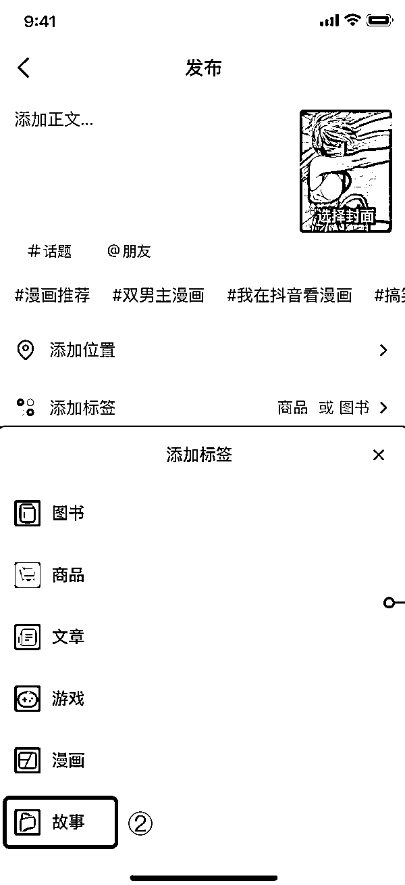
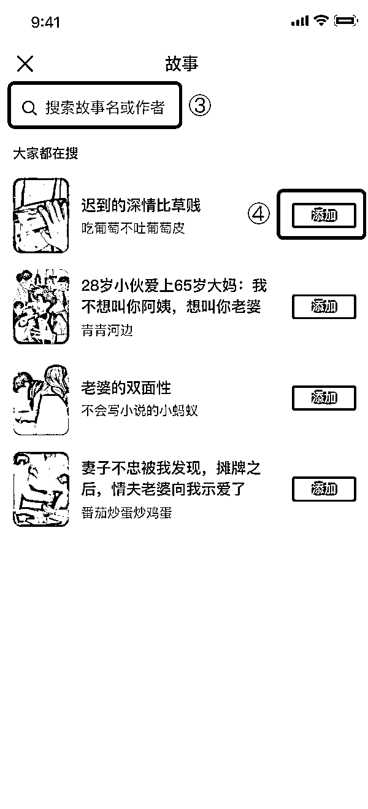
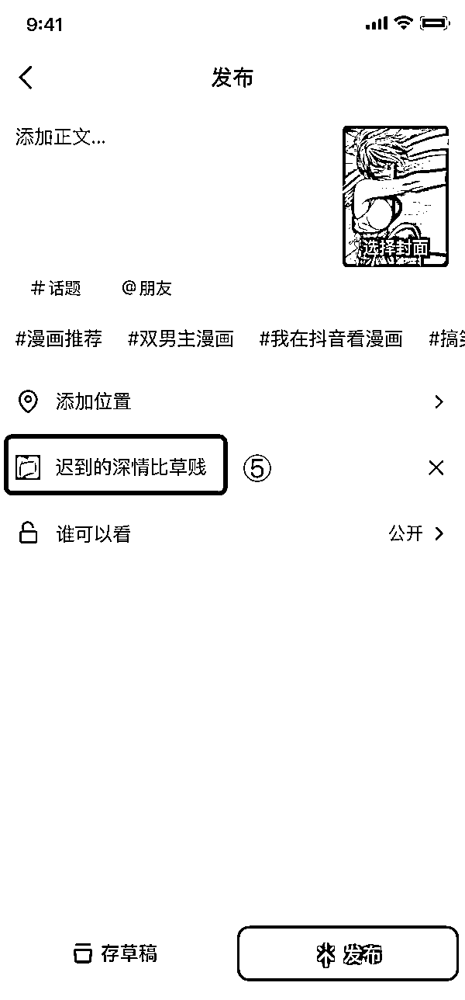
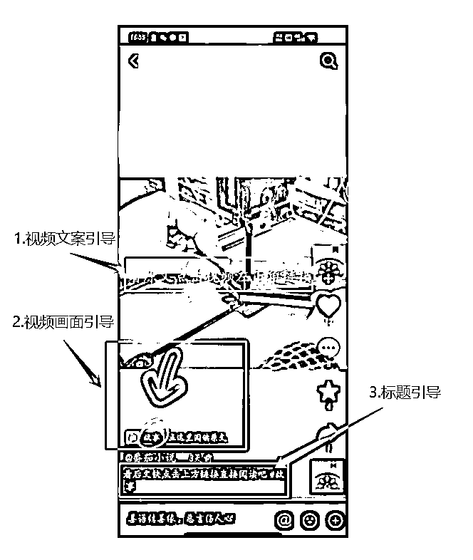
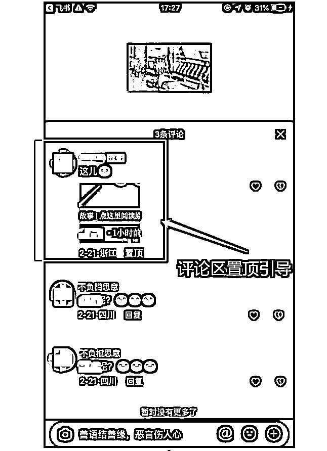

# 2.7.2 达人绑定流程

来解决上一节提出的问题，我们该如何绑定这个推广系统，通过在抖音视频中添加锚点，引导大家点击小说呢？这里暂时不会用到上面提到的操作流程，请按照下方的步骤来操作。

第一步：首先需要报备自己的抖音号及其它参数

报备链接：

[`docs.qq.com/form/page/DSER0VHptVEpZc0RN`](https://docs.qq.com/form/page/DSER0VHptVEpZc0RN)

升级版本：一定要将抖音升级到最新版本 2430 抖音 uid/did 查询：抖音→我的→右上角→设置→最下方空白处连续点击

报备完成后在当天 20 点左右（最晚不会超过次日早上 10:00）可在下面链接中查询审核结果：

[`jinshuju.net/f/G4wvqb/s/hjnHdn`](https://jinshuju.net/f/G4wvqb/s/hjnHdn)

报备并审核成功后即可获得添加故事标签权限。

第二步：得到反馈已成功报名后，在抖音中点击“+”发布视频，在发布页点击“添加标签”-“故事”-“搜索书籍”选取对应的短故事书籍（支持 bookid、书名、作者名搜索）。

! ! 注意：

不要同时添加“位置”和“标签”。抖音默认“添加位置”的优先级最高，如果选了位置会把锚点覆盖掉。

第三步：请在发布视频前确定已添加对应书籍标签，发出视频后用户会在你的视频左下角看到故事锚点。

添加成功后发布路径图示：

第四步：在视频中引导粉丝点击锚点获得收益

若视频中无任何锚点点击引导，极有可能无法获取订单收益，导致视频为无效引流。

我们可以从以下几个角度来做引导：

1.视频画面：创作者在创作视频中加入箭头或其他标识引导粉丝点击锚点

2.口播话术：等待后续更新补充 ing

3.标题文案：视频标题引导粉丝点击锚点，常见话术「看后文快点击上方链接直接阅读吧」

4.置顶评论：可采用表情包或文字多种方式引导粉丝点击锚点

