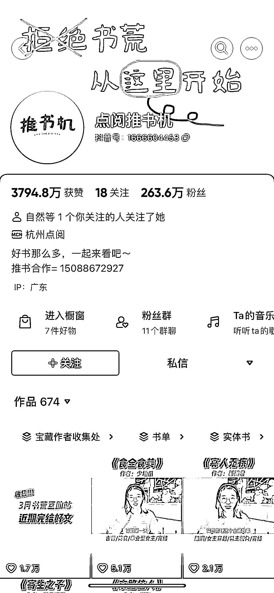
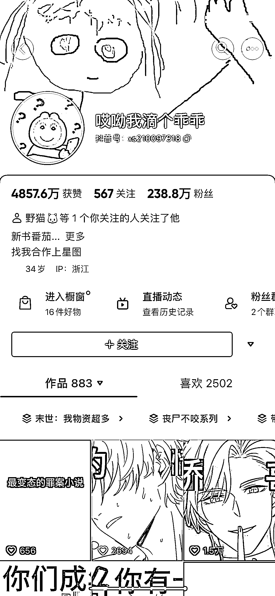
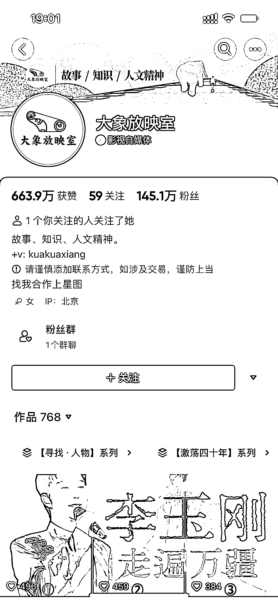

# 3.2.3.1 账号包装

顾名思义，账号包装就是把抖音个人主页包装得更加好看、风格更加统一。昵称、头像、简介、抖音号、主页头图都属于账号包装的范畴。

完善的账号包装能够给路人留下更好的第一印象，可以让人一眼看懂你的账号定位，帮助你增加关注概率。

1）头像

头像可以是真人，也可以是虚拟图画。但一定要记住，头像影响着观众对你的第一印象，选一个最能体现个人特色的头像即可。

2）昵称

朗朗上口的昵称，能让粉丝迅速记住你，因此昵称应具备以下几个特点：

•独特好记

•贴合定位

•体现价值

3）帐号简介

个人简介在个人主页占的位置比较大，而且好处也颇多，那你说，这个位置写些什么比较好呢？ 个人简介应具备以下要点：

①通俗易懂且完整的一句话定位

②定位要具有差异性，不要跟别人的定位重复

③后期即使更改简介，一句话定位也不要轻易修改

比如：

•分享精彩小说，沙雕段子不断！•不会写小说的漫画家，不是一个好的剪辑师•书龄 10 年/be 美学爱好者/磕糖选手•10 年老书虫，主看推理悬疑文 （番茄），我在前面探路，你们只管跟着我

4）头图指引

头图也叫背景图，就是你个人主页最上面那张图，注意以下几点：

•头图不要糊，要选高清大图

•体现你的个人风格

•可以把昵称、口头禅、个人简介里的话都放上去

