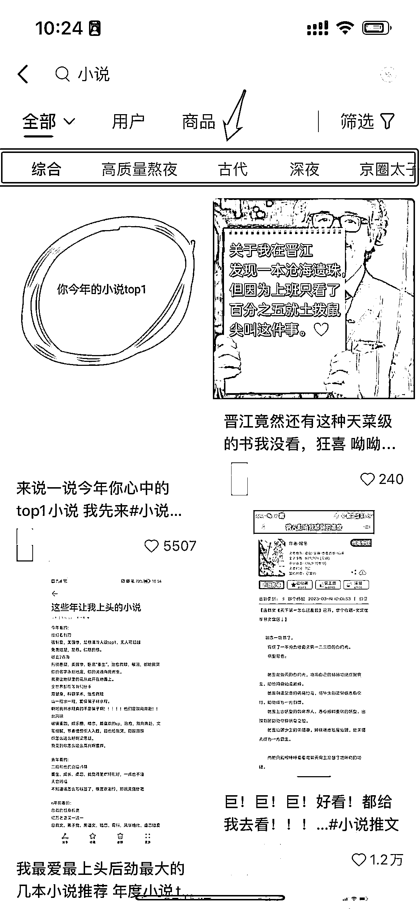
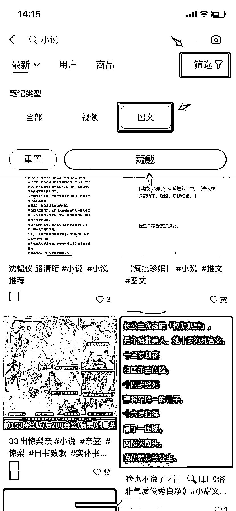
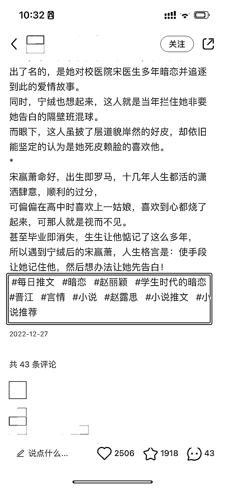
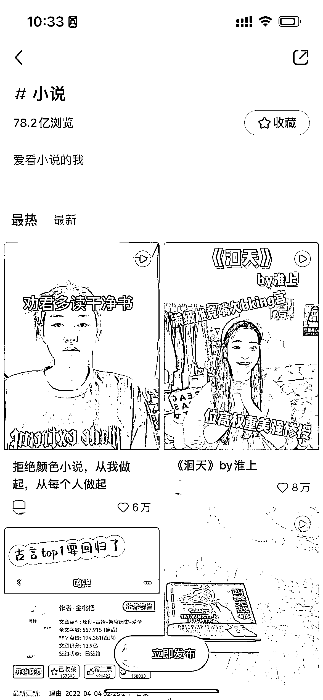

# 3.3.2 寻找对标账号 @seven

小红书与抖音相似，也是通过搜索小说标签，找到对标账号。

在搜索栏搜「小说」等关键词，会出现大量相关笔记，如果对内容还有细分要求，可以点击上方的分类栏进行筛选。

小红书流量最好的还是图文，所以我们在选择对标账号的时候，在筛选里面，选择「图文」，选择「最新」，基本就能看到一些推文账号。

我们需要点击进入某一笔记，选择笔记下面的标签，每个标签下面都会有大量的对标图文，重复这个步骤就会选到很多对标账号：

