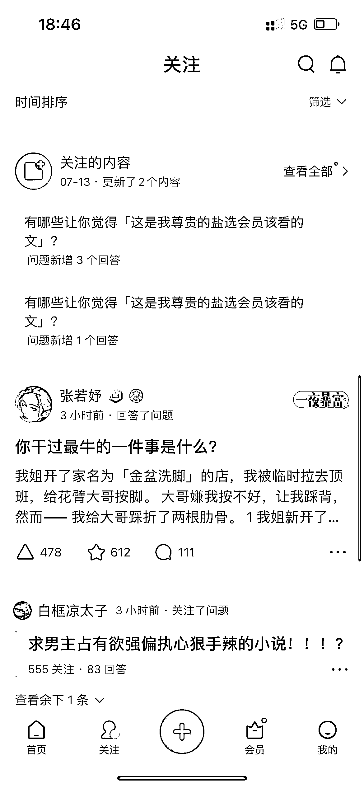
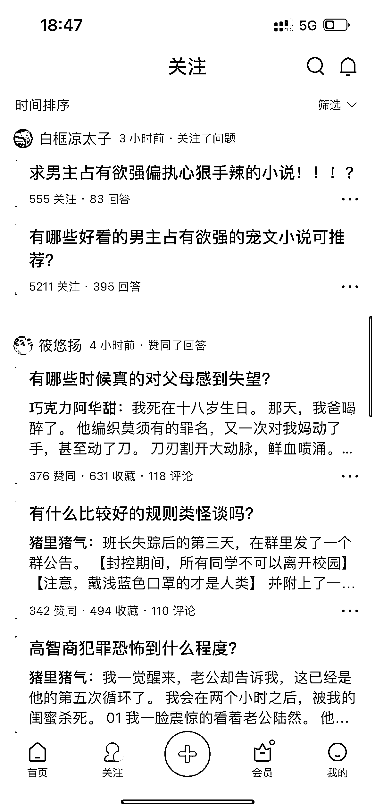
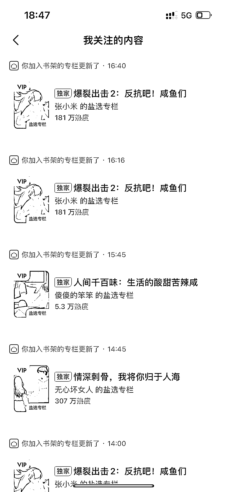

# 方法一：根据优质作者选文

平台上的小说茫茫多，哪怕是借助工具批量筛选都看不过来，更不用提 “有哪些好看的 xx 文” 这种问题下几千上万个回答，更新频率高但质量良莠不齐，但有个点是不变的：文章都是作者写出来的。

抓住了作者，就可以说抓住了稳定的文章来源。不需要经常去翻阅问题的新回答，把重心从问题上移到回答问题的人身上，作者是最稳定的文章产出。

那么很显然，优质的作者=优质的文章来源，比如知乎上的巧克力阿华甜、白框凉太子、张若妤等等，人家是坐拥几十上百万粉丝专业的作者，对于创作热点、创作套路的理解比我们强，与其在问题回答下大浪淘沙，不如紧跟这些优质作者。

关注 8-10 个符合账号定位的优质作者，在知乎——动态里可以看到他们每天点赞的文章、关注的问题、发布的回答还有他们关注的作者，顺腾摸瓜挨个找下去，根本不缺文章来源，需要做的是对文章内容进行筛选。

关注好作者/专栏后，每天选定几个时间点 “收菜” 就可以了，不仅能直观看到优质作者的最新动态、争取文章首发，还能捕捉盐选专栏动态，抢占关键词先发制人。

需要注意的是，知乎上的小说一般分为问答和专栏形式，不管其是那种形式，在复制链接前，我们都需要先确认文章是否为会员文。打开文章后，滑到文末，出现付费提示的就是会员文，可以用于推广。